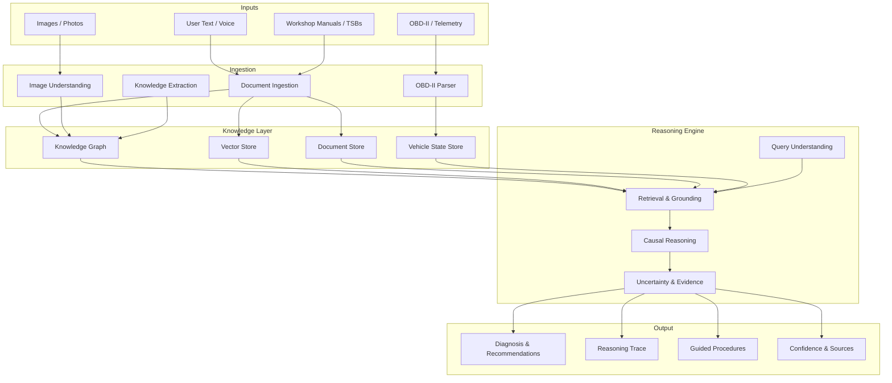

# Architecture Overview

## Why This Document Exists

This document describes the **high-level architecture** of MechAI: the major components, how they interact, and the design principles that shape the system. It is the first document an engineer or AI agent reads when designing a new component or understanding the system as a whole.

This is a **target architecture**. The repository currently contains no product code — this document describes the shape the system will take as we build it. It is a living document, updated as the architecture evolves (with significant changes recorded as ADRs).

## Design Principles

The architecture is shaped by the [Development Philosophy](../04-development-philosophy.md) and the [Product Philosophy](../03-product-philosophy.md). The most important architectural principles:

1. **Modularity:** Components are independent, testable, and replaceable.
2. **Evidence-first:** The data model and reasoning pipeline are built around provenance and traceability.
3. **Reasoning over retrieval:** The architecture favors a knowledge-graph + reasoning approach over naive RAG.
4. **Multi-modal by design:** Text, OBD-II, images, and voice are first-class inputs from the start.
5. **Deployable anywhere:** The same core must run in SaaS and on-premises.
6. **Agent-friendly:** The architecture is documented and structured so AI agents can contribute safely.

## High-Level Architecture

## Component Descriptions

### 1. Inputs

| Input | Description | Status |
|-------|-------------|--------|
| **User Text / Voice** | Natural language questions, symptom descriptions, follow-ups. Voice is a future modality. | Future |
| **OBD-II / Telemetry** | Diagnostic trouble codes (DTCs), live sensor data, freeze-frame data. | Future |
| **Images / Photos** | Photos of parts, dashboards, wiring, wear patterns. | Future |
| **Workshop Manuals / TSBs** | Structured and unstructured automotive knowledge: repair procedures, specs, service bulletins. | Future |

### 2. Ingestion

| Component | Purpose |
|-----------|---------|
| **Document Ingestion** | Parse manuals, TSBs, and other documents into structured knowledge. |
| **OBD-II Parser** | Decode OBD-II frames into standardized DTCs and sensor values. |
| **Image Understanding** | Extract information from photos (part identification, wear assessment). |
| **Knowledge Extraction** | Build the knowledge graph from documents: components, systems, failure modes, procedures. |

### 3. Knowledge Layer

| Component | Purpose |
|-----------|---------|
| **Knowledge Graph** | The structured representation of automotive knowledge: components, systems, relationships, failure propagation. This is the heart of the "reason, don't parrot" philosophy. |
| **Vector Store** | Semantic search over documents for retrieval. Complements, not replaces, the knowledge graph. |
| **Document Store** | The raw source documents, with provenance metadata. |
| **Vehicle State Store** | Persistent per-vehicle state: DTCs, sensor history, repair history, wear patterns. |

### 4. Reasoning Engine

| Component | Purpose |
|-----------|---------|
| **Query Understanding** | Parse the user's question into an intent and constraints. |
| **Retrieval & Grounding** | Retrieve relevant knowledge from the graph, vector store, and vehicle state. Ground every claim in a source. |
| **Causal Reasoning** | Reason over the knowledge graph: how symptoms propagate, what faults explain the evidence. |
| **Uncertainty & Evidence** | Quantify confidence, distinguish known vs. inferred vs. hypothesis, and assemble the evidence trail. |

### 5. Output

| Component | Purpose |
|-----------|---------|
| **Diagnosis & Recommendations** | The ranked, evidence-backed answer. |
| **Reasoning Trace** | The inspectable chain of reasoning, so users and engineers can verify the answer. |
| **Guided Procedures** | Step-by-step verification procedures tailored to the user's skill level. |
| **Confidence & Sources** | Explicit confidence levels and citations for every claim. |

## Key Architectural Decisions (Summary)

These are the architectural decisions that shape the system. Each has (or will have) a full ADR.

| Decision | Rationale | ADR |
|----------|-----------|-----|
| Knowledge graph as the core reasoning substrate | Enables causal reasoning, not just retrieval | ADR-0001 (planned) |
| Vector store as a complement, not the core | Retrieval alone cannot reason causally | ADR-0002 (planned) |
| Multi-modal inputs from the start | The product philosophy requires evidence from multiple sources | ADR-0003 (planned) |
| SaaS + on-premises from the start | The mission requires serving privacy-sensitive customers | ADR-0004 (planned) |
| Python as the primary language | Strong AI/ML ecosystem, team familiarity | ADR-0005 (planned) |

## Current State of the Architecture

**As of the seed foundation, the repository contains no product code.** The architecture described here is the target. The immediate engineering work is:

1. Establish the repository foundation (this work).
2. Research the knowledge representation problem (see [`docs/research/`](../research/)).
3. Prototype the knowledge graph and reasoning pipeline in experiments (see [`experiments/`](../../experiments/)).
4. Record the foundational ADRs as decisions are made.

## How to Use This Document

1. **Designing a new component?** Read this document to understand where it fits.
2. **Working on data?** Read the [Data Flows](03-data-flows.md) document.
3. **Planning for growth?** Read the [Future Scaling](04-future-scaling.md) document.
4. **Making a significant change?** Write an ADR and update this document.

## Related Documents

- [Repository Guide](02-repository-guide.md) — where things live.
- [Data Flows](03-data-flows.md) — how data moves.
- [Future Scaling](04-future-scaling.md) — how this evolves.
- [ADR System](../adr/README.md) — how decisions are recorded.
