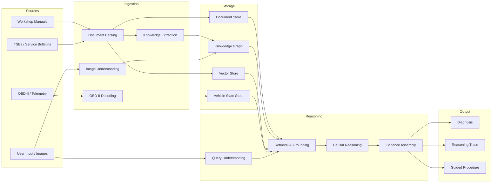

# Data Flows

## Why This Document Exists

This document describes **how data moves through the MechAI system**: from raw inputs (manuals, OBD-II, images, user questions) through ingestion, storage, reasoning, and output. It is the reference for anyone working on data pipelines, storage, or the reasoning engine.

Understanding data flows is essential because MechAI's core value is **evidence-based reasoning**. Every piece of data must carry provenance so that every answer can be traced back to a source.

## The Data Lifecycle

## Data Flow Stages

### 1. Sources

| Source | Description | Data Characteristics |
|--------|-------------|----------------------|
| **Workshop Manuals** | Repair procedures, torque specs, wiring diagrams, fault trees. | Semi-structured; often PDF; per-vehicle-model. |
| **TSBs / Service Bulletins** | Known issues and fixes from manufacturers. | Semi-structured; time-sensitive; per-model. |
| **OBD-II / Telemetry** | DTCs, live sensor values, freeze-frame data. | Structured; time-series; per-vehicle. |
| **User Input / Images** | Natural language questions, symptom descriptions, photos. | Unstructured; multi-modal; per-session. |

### 2. Ingestion

| Component | Purpose | Output |
|-----------|---------|--------|
| **Document Parsing** | Convert PDFs/HTML into structured text with page/section references. | Structured documents with provenance. |
| **Knowledge Extraction** | Extract entities (components, systems, failure modes) and relationships from documents. | Knowledge graph triples. |
| **OBD-II Decoding** | Decode raw OBD-II frames into standardized DTCs and sensor values. | Normalized vehicle data. |
| **Image Understanding** | Identify parts, assess wear, read dashboards from photos. | Structured image annotations. |

### 3. Storage

| Store | Purpose | Key Property |
|-------|---------|--------------|
| **Document Store** | Raw source documents with metadata. | Provenance: source, page, section. |
| **Knowledge Graph** | Structured automotive knowledge: components, systems, relationships, failure propagation. | Causal relationships. |
| **Vector Store** | Semantic embeddings of documents for retrieval. | Similarity search. |
| **Vehicle State Store** | Per-vehicle persistent state: DTCs, sensor history, repairs. | Time-series, per-vehicle. |

### 4. Reasoning

| Component | Purpose |
|-----------|---------|
| **Query Understanding** | Parse the user's question into intent, vehicle context, and constraints. |
| **Retrieval & Grounding** | Retrieve relevant knowledge from all stores; ground every claim in a source. |
| **Causal Reasoning** | Reason over the knowledge graph: what faults explain the evidence, how symptoms propagate. |
| **Evidence Assembly** | Combine retrieved knowledge, vehicle state, and reasoning into a ranked, evidence-backed answer. |

### 5. Output

| Output | Description |
|--------|-------------|
| **Diagnosis** | The ranked answer with confidence levels. |
| **Reasoning Trace** | The inspectable chain of reasoning, with citations. |
| **Guided Procedure** | Step-by-step verification steps tailored to the user. |

## Provenance: The Critical Requirement

**Every piece of data in the system must carry provenance.** This is the foundation of the "evidence is everything" product philosophy.

| Data | Provenance Required |
|------|---------------------|
| Document chunk | Source document, page, section, version |
| Knowledge graph triple | Source document(s), extraction method, confidence |
| OBD-II value | Vehicle, timestamp, PID, raw frame |
| Image annotation | Source image, model version, confidence |
| Reasoning step | Inputs used, rules applied, sources cited |

**Design implication:** The data model must be built around provenance from day one. Adding provenance later is expensive and error-prone.

## Data Quality & Validation

- **At ingestion:** Validate structure, reject malformed data, record failures.
- **At storage:** Enforce schema, deduplicate, track versions.
- **At reasoning:** Check for conflicting evidence, flag low-confidence sources.
- **At output:** Never present ungrounded claims as facts.

## Privacy & Data Handling

- **Vehicle data is sensitive.** Real VINs, license plates, and customer PII must never appear in tests, examples, or docs. Use synthetic data.
- **Per-vehicle state** must be isolated and access-controlled.
- **On-premises deployment** must be able to keep all data local. See [Security Policy](../../SECURITY.md) and [Future Scaling](04-future-scaling.md).

## Current State

**As of the seed foundation, no data pipelines exist.** This document describes the target data flows. The immediate work is research into knowledge representation (see [`research/`](../research/)) and prototyping in [`experiments/`](../../experiments/).

## Related Documents

- [Architecture Overview](01-architecture-overview.md) — the system components.
- [Future Scaling](04-future-scaling.md) — how data flows scale.
- [Security Policy](../../SECURITY.md) — data handling requirements.
- [Research](../research/README.md) — open questions about data and knowledge.