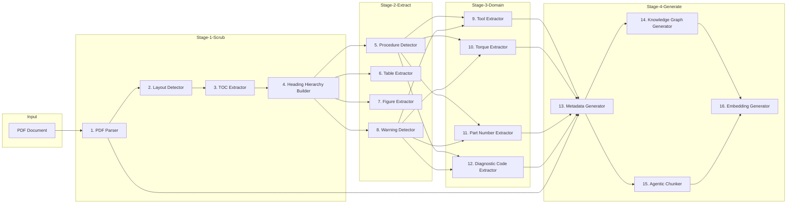

# Ingestion Pipeline Architecture

## Why This Document Exists

This document describes the **high-level architecture** of the document ingestion pipeline. It defines the stages, their responsibilities, the data flow between them, and the design principles that shape the implementation. It is the first document an engineer or AI agent reads when working on the pipeline.

## Design Principles

1. **One stage, one responsibility.** Each stage does exactly one thing and does it well.
2. **Single direction of data flow.** Data flows forward through the pipeline; no stage reaches back to a previous stage.
3. **Every artifact carries provenance.** Every output references the source page, region, and extraction method that produced it.
4. **Independently testable.** Each stage has a well-defined interface and can be tested in isolation with synthetic data.
5. **Deterministic where possible, model-assisted where necessary.** Rule-based extraction is preferred for precision-critical artifacts (torque, part numbers); LLM-assisted extraction is used where rules are insufficient (procedures, warnings).
6. **Composable.** Stages are assembled by an orchestrator; new stages can be inserted or removed without touching other stages.

## Pipeline Overview



## Stage Descriptions

### Stage 1: Document Scrubbing

These stages convert the raw PDF into a structured, searchable document representation.

#### 1. PDF Parser

| Attribute | Value |
|-----------|-------|
| **Input** | Raw PDF bytes / file path |
| **Output** | `ParsedDocument` — list of `Page` objects, each with extracted text, embedded images, and character/word coordinates |
| **Responsibility** | Extract raw text, images, and positional data from the PDF |
| **Key decisions** | Use `pypdf` for text and `pdfplumber` for positional layout data |
| **Independently testable?** | Yes — feed a synthetic PDF, assert text and image extraction |

#### 2. Layout Detector

| Attribute | Value |
|-----------|-------|
| **Input** | `ParsedDocument` |
| **Output** | `LayoutDocument` — pages with `LayoutElement` objects (paragraph, heading, table, figure, list, code) |
| **Responsibility** | Classify each page region into a layout type using font size, position, and whitespace heuristics |
| **Key decisions** | Rule-based classification; LLM fallback for ambiguous regions |
| **Independently testable?** | Yes — feed synthetic PDFs with known layout types |

#### 3. TOC Extractor

| Attribute | Value |
|-----------|-------|
| **Input** | `LayoutDocument` |
| **Output** | `Toc` — ordered list of `TocEntry` (level, title, page reference) |
| **Responsibility** | Identify the table of contents pages and extract chapter/section entries with their target pages |
| **Key decisions** | Heuristic detection of TOC pages (dotted leaders, page numbers); LLM fallback |
| **Independently testable?** | Yes — synthetic TOC pages with known entries |

#### 4. Heading Hierarchy Builder

| Attribute | Value |
|-----------|-------|
| **Input** | `LayoutDocument` + `Toc` |
| **Output** | `HeadingTree` — hierarchical tree of `HeadingNode` objects |
| **Responsibility** | Build the document outline from headings, using the TOC as a cross-reference to resolve levels |
| **Key decisions** | Merge TOC-level hints with layout-level font analysis to resolve ambiguity |
| **Independently testable?** | Yes — synthetic documents with known heading levels |

### Stage 2: Content Extraction

These stages detect and extract structural content from the scrubbed document.

#### 5. Procedure Detector

| Attribute | Value |
|-----------|-------|
| **Input** | `HeadingTree` + `LayoutDocument` |
| **Output** | `ProcedureSet` — list of `Procedure` objects with step sequences |
| **Responsibility** | Identify repair procedures (e.g., "Removal", "Installation", "Inspection") and extract their ordered steps |
| **Key decisions** | Numbered lists following procedural headings; LLM-assisted step boundary detection |
| **Independently testable?** | Yes — synthetic procedures with known step counts |

#### 6. Table Extractor

| Attribute | Value |
|-----------|-------|
| **Input** | `LayoutDocument` |
| **Output** | `TableSet` — list of `ExtractedTable` objects with rows/columns and caption |
| **Responsibility** | Detect table regions and convert them into structured row/column data |
| **Key decisions** | `pdfplumber` table extraction; normalize merged cells; carry caption and page reference |
| **Independently testable?** | Yes — synthetic PDF tables with known dimensions |

#### 7. Figure Extractor

| Attribute | Value |
|-----------|-------|
| **Input** | `LayoutDocument` |
| **Output** | `FigureSet` — list of `ExtractedFigure` objects with image bytes, caption, and page reference |
| **Responsibility** | Detect embedded images and figures, associate captions, and track source page |
| **Key decisions** | Image region detection via layout; caption proximity matching |
| **Independently testable?** | Yes — synthetic PDFs with embedded images and captions |

#### 8. Warning Detector

| Attribute | Value |
|-----------|-------|
| **Input** | `LayoutDocument` + `HeadingTree` |
| **Output** | `WarningSet` — list of `Warning` objects |
| **Responsibility** | Detect safety warnings (DANGER, WARNING, CAUTION, NOTE) and associate them with nearby content |
| **Key decisions** | Keyword/format detection (e.g., "⚠", bold caps); LLM fallback for paraphrased warnings |
| **Independently testable?** | Yes — synthetic pages with known warning phrases |

### Stage 3: Domain Extraction

These stages extract automotive-specific structured facts from the content.

#### 9. Tool Extractor

| Attribute | Value |
|-----------|-------|
| **Input** | `ProcedureSet` + `LayoutDocument` |
| **Output** | `ToolSet` — list of `Tool` objects (name, size, spec, source) |
| **Responsibility** | Identify tools mentioned in procedures (e.g., "10 mm socket", "torque wrench") |
| **Key decisions** | Regex + unit patterns (mm, inch, pt); LLM-assisted for descriptive tool mentions |
| **Independently testable?** | Yes — synthetic procedure text with known tools |

#### 10. Torque Extractor

| Attribute | Value |
|-----------|-------|
| **Input** | `ProcedureSet` + `LayoutDocument` |
| **Output** | `TorqueSet` — list of `Torque` objects (fastener, value, unit, spec) |
| **Responsibility** | Detect torque specifications (e.g., "Tighten to 25 N·m (18 ft·lb)") |
| **Key decisions** | Regex with unit patterns (N·m, ft·lb, lb-ft); validate range for reasonableness |
| **Independently testable?** | Yes — synthetic torque specs with known values |

#### 11. Part Number Extractor

| Attribute | Value |
|-----------|-------|
| **Input** | `ProcedureSet` + `LayoutDocument` |
| **Output** | `PartNumberSet` — list of `PartNumber` objects |
| **Responsibility** | Identify OEM part numbers and aftermarket references |
| **Key decisions** | Regex for OEM patterns (e.g., `1112233-A`, alphanumeric sequences); LLM-assisted for context disambiguation |
| **Independently testable?** | Yes — synthetic part number patterns |

#### 12. Diagnostic Code Extractor

| Attribute | Value |
|-----------|-------|
| **Input** | `LayoutDocument` + `ProcedureSet` |
| **Output** | `DiagnosticCodeSet` — list of `DiagnosticCode` objects (code, description, symptom, source) |
| **Responsibility** | Identify OBD-II diagnostic trouble codes (DTCs) and their descriptions |
| **Key decisions** | Regex for OBD-II codes (e.g., `P0301`, `C1234`); associate with nearby symptom text |
| **Independently testable?** | Yes — synthetic DTC text with known codes |

### Stage 4: Knowledge Generation

These stages produce the structured outputs consumed downstream by the knowledge layer.

#### 13. Metadata Generator

| Attribute | Value |
|-----------|-------|
| **Input** | All prior stage outputs |
| **Output** | `DocumentMetadata` — make, model, year, system, document type, page count |
| **Responsibility** | Infer document-level metadata from title page, headers, and domain extraction results |
| **Key decisions** | Heuristic + LLM-assisted extraction of vehicle identifiers |
| **Independently testable?** | Yes — synthetic title pages with known metadata |

#### 14. Knowledge Graph Generator

| Attribute | Value |
|-----------|-------|
| **Input** | All prior structured outputs |
| **Output** | `GraphModel` — nodes and edges with provenance |
| **Responsibility** | Assemble knowledge graph triplets from extracted entities: components, systems, tools, torque specs, warnings, procedures, diagnostic codes |
| **Key decisions** | Deterministic node/edge construction from structured stage outputs; no free-form LLM graph generation |
| **Independently testable?** | Yes — feed known extracted outputs, assert graph structure |

#### 15. Agentic Chunker

| Attribute | Value |
|-----------|-------|
| **Input** | `ParsedDocument` + `HeadingTree` + `ProcedureSet` |
| **Output** | `ChunkSet` — list of `AgenticChunk` objects |
| **Responsibility** | Segment the document into coherent, self-contained text chunks aligned to semantic boundaries (headings, procedures), sized for embedding |
| **Key decisions** | Boundary-aware chunking (section/procedure-aware), not naive fixed-size splitting |
| **Independently testable?** | Yes — synthetic documents with known semantic boundaries |

#### 16. Embedding Generator

| Attribute | Value |
|-----------|-------|
| **Input** | `ChunkSet` |
| **Output** | `EmbeddingSet` — list of `ChunkEmbedding` objects |
| **Responsibility** | Generate vector embeddings for each chunk |
| **Key decisions** | Abstract `EmbeddingProvider` interface; deterministic in-memory provider for tests, external provider (e.g., `sentence-transformers`) for production |
| **Independently testable?** | Yes — mock provider returns deterministic vectors |

## Data Flow Summary

```
Input: PDF
  → 1. ParsedDocument
  → 2. LayoutDocument
  → 3. Toc
  → 4. HeadingTree
  → 5. ProcedureSet  → 9-12. Domain artifacts
  → 6. TableSet
  → 7. FigureSet
  → 8. WarningSet
  → 13. DocumentMetadata
  → 14. GraphModel
  → 15. ChunkSet
  → 16. EmbeddingSet
```

## Orchestration

A single `IngestionPipeline` class composes all stages. It:

1. Accepts a raw `bytes` or `Path` as input.
2. Runs each stage in order, passing the previous stage's output as input.
3. Collects stage outputs into a final `PipelineResult`.
4. Logs each stage's start, duration, and output artifact count using the project's structured logging philosophy.
5. Raises a typed `IngestionError` if any stage fails, with the stage name in context.

The orchestrator is the only component that knows about stage ordering. Each stage is a standalone, independently testable unit.

## Errors & Failure Modes

| Failure | Handling |
|---------|----------|
| PDF unreadable / corrupt | `DocumentParseError`; pipeline halts |
| Layout detection uncertainty | Log a warning; default to `paragraph` type |
| Missing TOC | `TocExtractionError`; heading hierarchy falls back to layout-only |
| Missing table caption | `TableExtractor` continues with `caption=None`; provenance preserved via page/table index |
| Torque unit unrecognized | `TorqueExtractor` skips the value, logs a warning |
| Embedding provider unavailable | `EmbeddingError`; pipeline halts (chunks still produced) |

## Design Decisions

### Stage Granularity

**Decision:** 16 distinct stages, each with one responsibility.

**Why:** A workshop manual is heterogeneous — it mixes prose, tables, figures, warnings, and structured specs. A single monolithic parser cannot cleanly handle all of these. Splitting into focused stages makes each independently testable and maintainable, and allows future stages (e.g., a wiring-diagram extractor) to be added without touching existing stages.

### Deterministic Extraction First, LLM Second

**Decision:** Rule-based extraction (regex, layout heuristics) is the default for precision-critical artifacts. LLM-assisted extraction is used only where rules are insufficient (procedures, warnings, metadata).

**Why:** The product philosophy requires precision and provenance for facts like torque and part numbers. A rule-based extractor is deterministic, testable, and auditable. The LLM is a fallback for ambiguity, where its output is always validated and labeled as `extraction_method="llm"`.

### Provenance in Every Artifact

**Decision:** Every extracted artifact carries `source_page`, `source_region`, and `extraction_method`.

**Why:** The data flows document ([03-data-flows.md](../03-data-flows.md)) requires that every piece of knowledge carry provenance. This is the foundation of the "evidence is everything" product philosophy.

### Embedding as the Final Stage

**Decision:** Embedding generation is the last stage in the pipeline.

**Why:** Embeddings require the chunks produced by the agentic chunker. Keeping embedding as a separate stage allows the chunker to be tested independently and allows the embedding provider to be swapped without touching the chunker.

## How to Use This Document

1. **Implementing a stage?** Read the stage description and the [Interfaces](03-interfaces.md) document.
2. **Testing a stage?** Read the [Testing Philosophy](../../engineering/05-testing-philosophy.md) and the [Implementation Plan](05-implementation-plan.md).
3. **Reviewing the design?** Check each stage has exactly one responsibility and is independently testable.

## Related Documents

- [Folder Structure](02-folder-structure.md) — where the code lives.
- [Interfaces](03-interfaces.md) — stage contracts.
- [Data Models](04-data-models.md) — the Pydantic models.
- [Implementation Plan](05-implementation-plan.md) — build order.
- [Architecture Overview](../01-architecture-overview.md) — where this pipeline fits.
- [Data Flows](../03-data-flows.md) — how data moves.