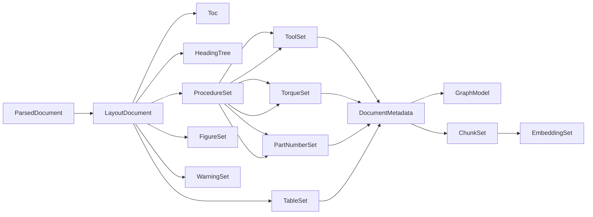

# Ingestion Pipeline Data Models

## Why This Document Exists

This document defines the **Pydantic data models** used across the ingestion pipeline. Every stage's input and output is one of these models. Provenance is a first-class concern: every extracted artifact carries its source page, region, and extraction method, per the [Data Flows](../03-data-flows.md) document.

All models use Pydantic v2. Models are immutable (`frozen=True`) and validated on construction.

## Foundation Models

### Provenance

```python
class ExtractionMethod(Enum):
    """How an artifact was extracted."""

    RULE = "rule"
    HEURISTIC = "heuristic"
    LLM = "llm"


class Region(BaseModel):
    """A bounding box on a page.

    Attributes:
        left: Left x-coordinate (points from page origin).
        top: Top y-coordinate.
        right: Right x-coordinate.
        bottom: Bottom y-coordinate.
    """

    model_config = ConfigDict(frozen=True)
    left: float
    top: float
    right: float
    bottom: float


class SourceRef(BaseModel):
    """Provenance reference to a source location in the document.

    Attributes:
        page_number: 1-based page number in the source PDF.
        region: Optional bounding region on the page (left, top, right, bottom).
        extraction_method: How the artifact was produced ("rule" | "llm" | "heuristic").
        confidence: Confidence 0.0-1.0 assigned to the extraction.
    """

    model_config = ConfigDict(frozen=True)
    page_number: int
    region: Region | None = None
    extraction_method: ExtractionMethod
    confidence: float = Field(default=1.0, ge=0.0, le=1.0)
```

## Stage 1 Models

### ParsedDocument (Stage 1 output)

```python
class Page(BaseModel):
    """A single parsed page.

    Attributes:
        page_number: 1-based page index.
        text: Full text content of the page.
        words: List of word-level positional data.
        images: List of embedded images.
    """

    model_config = ConfigDict(frozen=True)
    page_number: int
    text: str
    words: list[Word]
    images: list[PageImage]


class Word(BaseModel):
    """A word with positional data."""

    model_config = ConfigDict(frozen=True)
    text: str
    left: float
    top: float
    right: float
    bottom: float
    font_size: float | None = None
    font_name: str | None = None
    bold: bool = False


class PageImage(BaseModel):
    """An embedded image on a page."""

    model_config = ConfigDict(frozen=True)
    image_id: str
    data: bytes
    region: Region | None = None
    width: int
    height: int


class ParsedDocument(BaseModel):
    """Stage 1 output: the parsed PDF.

    Attributes:
        pages: Ordered list of pages.
        source_path: Original source path (if provided).
        total_pages: Count of pages.
    """

    model_config = ConfigDict(frozen=True)
    pages: list[Page]
    source_path: str | None = None

    @property
    def total_pages(self) -> int:
        """Return the number of pages."""
        return len(self.pages)
```

### LayoutDocument (Stage 2 output)

```python
class LayoutType(Enum):
    """The layout classification of a region."""

    PARAGRAPH = "paragraph"
    HEADING = "heading"
    TABLE = "table"
    FIGURE = "figure"
    LIST = "list"
    CODE = "code"
    TOC = "toc"
    UNKNOWN = "unknown"


class LayoutElement(BaseModel):
    """A classified region of a page.

    Attributes:
        element_id: Stable identifier within the document.
        layout_type: The classified layout type.
        text: Text content (may be empty for figures).
        page_number: 1-based page index.
        region: Bounding region on the page.
        heading_level: For HEADING elements, the hierarchy level (1-based).
        source_ref: Provenance reference.
    """

    model_config = ConfigDict(frozen=True)
    element_id: str
    layout_type: LayoutType
    text: str
    page_number: int
    region: Region
    heading_level: int | None = None
    source_ref: SourceRef


class LayoutDocument(BaseModel):
    """Stage 2 output: pages with typed layout elements.

    Attributes:
        elements: Flattened list of all layout elements (ordered by page, top-to-bottom).
    """

    model_config = ConfigDict(frozen=True)
    elements: list[LayoutElement]
```

### Toc (Stage 3 output)

```python
class TocEntry(BaseModel):
    """A single table-of-contents entry.

    Attributes:
        level: Heading level (1 = chapter, 2 = section, etc.).
        title: Section title.
        target_page: Page number referenced by the TOC.
        source_ref: Provenance reference.
    """

    model_config = ConfigDict(frozen=True)
    level: int
    title: str
    target_page: int
    source_ref: SourceRef


class Toc(BaseModel):
    """Stage 3 output: the table of contents.

    Attributes:
        entries: Ordered list of TOC entries.
        detected: Whether a TOC was detected (False if absent).
    """

    model_config = ConfigDict(frozen=True)
    entries: list[TocEntry]
    detected: bool
```

### HeadingTree (Stage 4 output)

```python
class HeadingNode(BaseModel):
    """A node in the heading hierarchy tree.

    Attributes:
        node_id: Stable identifier.
        title: Heading text.
        level: Heading level (1-based).
        page_number: 1-based page index.
        parent_id: ID of the parent node (None for root).
        children: Ordered list of child nodes.
        source_ref: Provenance reference.
    """

    model_config = ConfigDict(frozen=True)
    node_id: str
    title: str
    level: int
    page_number: int
    parent_id: str | None = None
    children: list[HeadingNode] = Field(default_factory=list)
    source_ref: SourceRef


class HeadingTree(BaseModel):
    """Stage 4 output: the hierarchical heading tree.

    Attributes:
        roots: Top-level heading nodes.
        nodes: Flattened list of all nodes (for lookup).
    """

    model_config = ConfigDict(frozen=True)
    roots: list[HeadingNode]
    nodes: list[HeadingNode]
```

## Stage 2 Models

### ProcedureSet (Stage 5 output)

```python
class ProcedureType(Enum):
    """Category of a repair procedure."""

    REMOVAL = "removal"
    INSTALLATION = "installation"
    INSPECTION = "inspection"
    ADJUSTMENT = "adjustment"
    DIAGNOSIS = "diagnosis"
    GENERAL = "general"


class ProcedureStep(BaseModel):
    """A single step in a procedure.

    Attributes:
        step_number: 1-based step index.
        text: Step instruction text.
        source_ref: Provenance reference.
    """

    model_config = ConfigDict(frozen=True)
    step_number: int
    text: str
    source_ref: SourceRef


class Procedure(BaseModel):
    """A repair procedure.

    Attributes:
        procedure_id: Stable identifier.
        title: Procedure title (e.g., "Removal", "Installation").
        procedure_type: Category (removal, installation, inspection, adjustment, diagnosis).
        steps: Ordered list of steps.
        heading_id: ID of the heading this procedure belongs to.
        system: Vehicle system (e.g., "braking", "charging").
        source_ref: Provenance reference.
    """

    model_config = ConfigDict(frozen=True)
    procedure_id: str
    title: str
    procedure_type: ProcedureType
    steps: list[ProcedureStep]
    heading_id: str | None = None
    system: str | None = None
    source_ref: SourceRef


class ProcedureSet(BaseModel):
    """Stage 5 output: detected procedures."""

    model_config = ConfigDict(frozen=True)
    procedures: list[Procedure]
```

### TableSet (Stage 6 output)

```python
class TableCell(BaseModel):
    """A single cell in an extracted table."""

    model_config = ConfigDict(frozen=True)
    text: str
    row: int
    column: int


class ExtractedTable(BaseModel):
    """An extracted table.

    Attributes:
        table_id: Stable identifier.
        caption: Table caption (may be None).
        headers: Optional list of header cell texts.
        rows: List of row cell lists.
        page_number: Source page.
        source_ref: Provenance reference.
    """

    model_config = ConfigDict(frozen=True)
    table_id: str
    caption: str | None
    headers: list[str]
    rows: list[list[str]]
    page_number: int
    source_ref: SourceRef


class TableSet(BaseModel):
    """Stage 6 output: extracted tables."""

    model_config = ConfigDict(frozen=True)
    tables: list[ExtractedTable]
```

### FigureSet (Stage 7 output)

```python
class ExtractedFigure(BaseModel):
    """An extracted figure or image.

    Attributes:
        figure_id: Stable identifier.
        caption: Figure caption (may be None).
        image_data: Raw image bytes.
        page_number: Source page.
        region: Bounding region on the page.
        source_ref: Provenance reference.
    """

    model_config = ConfigDict(frozen=True)
    figure_id: str
    caption: str | None
    image_data: bytes
    page_number: int
    region: Region | None
    source_ref: SourceRef


class FigureSet(BaseModel):
    """Stage 7 output: extracted figures."""

    model_config = ConfigDict(frozen=True)
    figures: list[ExtractedFigure]
```

### WarningSet (Stage 8 output)

```python
class WarningSeverity(Enum):
    """Severity of a safety warning."""

    DANGER = "danger"
    WARNING = "warning"
    CAUTION = "caution"
    NOTE = "note"


class Warning(BaseModel):
    """A detected safety warning.

    Attributes:
        warning_id: Stable identifier.
        severity: The warning severity.
        text: The warning text.
        page_number: Source page.
        related_heading_id: Heading this warning belongs to (if any).
        source_ref: Provenance reference.
    """

    model_config = ConfigDict(frozen=True)
    warning_id: str
    severity: WarningSeverity
    text: str
    page_number: int
    related_heading_id: str | None = None
    source_ref: SourceRef


class WarningSet(BaseModel):
    """Stage 8 output: detected warnings."""

    model_config = ConfigDict(frozen=True)
    warnings: list[Warning]
```

## Stage 3 Models

### ToolSet (Stage 9 output)

```python
class Tool(BaseModel):
    """An extracted tool.

    Attributes:
        tool_id: Stable identifier.
        name: Tool name (e.g., "socket").
        size: Size value (e.g., 10.0).
        size_unit: Size unit (e.g., "mm", "in").
        specification: Additional spec (e.g., "12-point").
        procedure_id: Procedure this tool was extracted from.
        source_ref: Provenance reference.
    """

    model_config = ConfigDict(frozen=True)
    tool_id: str
    name: str
    size: float | None = None
    size_unit: str | None = None
    specification: str | None = None
    procedure_id: str | None = None
    source_ref: SourceRef


class ToolSet(BaseModel):
    """Stage 9 output: extracted tools."""

    model_config = ConfigDict(frozen=True)
    tools: list[Tool]
```

### TorqueSet (Stage 10 output)

```python
class Torque(BaseModel):
    """An extracted torque specification.

    Attributes:
        torque_id: Stable identifier.
        fastener: Fastener description (e.g., "crankshaft pulley bolt").
        value: Torque value (e.g., 25.0).
        unit: Torque unit (e.g., "N.m", "ft-lb").
        is_angle: True if expressed as an angle (e.g., "rotate 90°").
        angle_degrees: Angle value if is_angle.
        procedure_id: Procedure this torque was extracted from.
        source_ref: Provenance reference.
    """

    model_config = ConfigDict(frozen=True)
    torque_id: str
    fastener: str
    value: float | None = None
    unit: str | None = None
    is_angle: bool = False
    angle_degrees: float | None = None
    procedure_id: str | None = None
    source_ref: SourceRef


class TorqueSet(BaseModel):
    """Stage 10 output: extracted torque specs."""

    model_config = ConfigDict(frozen=True)
    torques: list[Torque]
```

### PartNumberSet (Stage 11 output)

```python
class PartNumber(BaseModel):
    """An extracted part number.

    Attributes:
        part_number_id: Stable identifier.
        part_number: The part number string.
        description: Part description (may be None).
        procedure_id: Procedure this part was extracted from.
        source_ref: Provenance reference.
    """

    model_config = ConfigDict(frozen=True)
    part_number_id: str
    part_number: str
    description: str | None = None
    procedure_id: str | None = None
    source_ref: SourceRef


class PartNumberSet(BaseModel):
    """Stage 11 output: extracted part numbers."""

    model_config = ConfigDict(frozen=True)
    part_numbers: list[PartNumber]
```

### DiagnosticCodeSet (Stage 12 output)

```python
class DiagnosticCode(BaseModel):
    """An extracted diagnostic trouble code.

    Attributes:
        code_id: Stable identifier.
        code: The OBD-II code (e.g., "P0301").
        description: Human-readable description.
        symptom: Associated symptom text.
        procedure_id: Procedure this code was extracted from.
        source_ref: Provenance reference.
    """

    model_config = ConfigDict(frozen=True)
    code_id: str
    code: str
    description: str | None = None
    symptom: str | None = None
    procedure_id: str | None = None
    source_ref: SourceRef


class DiagnosticCodeSet(BaseModel):
    """Stage 12 output: extracted diagnostic codes."""

    model_config = ConfigDict(frozen=True)
    codes: list[DiagnosticCode]
```

## Stage 4 Models

### DocumentMetadata (Stage 13 output)

```python
class DocumentType(Enum):
    """Type of automotive document."""

    REPAIR_MANUAL = "repair_manual"
    SERVICE_MANUAL = "service_manual"
    TSB = "tsb"
    PARTS_CATALOG = "parts_catalog"
    OTHER = "other"


class DocumentMetadata(BaseModel):
    """Stage 13 output: document-level metadata.

    Attributes:
        make: Vehicle make (e.g., "Toyota") or None if unknown.
        model: Vehicle model or None.
        year: Model year or None.
        system: Primary vehicle system (e.g., "braking").
        document_type: Type of document ("repair_manual", "tsb", "service_manual").
        page_count: Total number of pages.
        title: Document title.
        source_ref: Provenance reference.
    """

    model_config = ConfigDict(frozen=True)
    make: str | None
    model: str | None
    year: int | None
    system: str | None
    document_type: DocumentType
    page_count: int
    title: str | None
    source_ref: SourceRef
```

### GraphModel (Stage 14 output)

```python
class NodeType(Enum):
    """Type of a knowledge graph node."""

    COMPONENT = "component"
    SYSTEM = "system"
    TOOL = "tool"
    PROCEDURE = "procedure"
    TORQUE = "torque"
    PART_NUMBER = "part_number"
    DIAGNOSTIC_CODE = "diagnostic_code"
    WARNING = "warning"
    SYMPTOM = "symptom"
    DOCUMENT = "document"


class EdgeType(Enum):
    """Type of a knowledge graph edge."""

    PART_OF = "PART_OF"
    USES = "USES"
    REQUIRES = "REQUIRES"
    TIGHTENED_TO = "TIGHTENED_TO"
    IDENTIFIED_BY = "IDENTIFIED_BY"
    WARNED_BY = "WARNED_BY"
    APPLIES_TO = "APPLIES_TO"
    REFERENCES = "REFERENCES"
    SYMPTOM_OF = "SYMPTOM_OF"


class GraphNode(BaseModel):
    """A node in the knowledge graph.

    Attributes:
        node_id: Stable identifier.
        node_type: Type of node.
        label: Human-readable label.
        properties: Additional properties as key-value pairs.
        source_ref: Provenance reference.
    """

    model_config = ConfigDict(frozen=True)
    node_id: str
    node_type: NodeType
    label: str
    properties: dict[str, str] = Field(default_factory=dict)
    source_ref: SourceRef


class GraphEdge(BaseModel):
    """An edge in the knowledge graph.

    Attributes:
        edge_id: Stable identifier.
        source_id: Source node ID.
        target_id: Target node ID.
        edge_type: Type of relationship.
        properties: Additional properties.
        source_ref: Provenance reference.
    """

    model_config = ConfigDict(frozen=True)
    edge_id: str
    source_id: str
    target_id: str
    edge_type: EdgeType
    properties: dict[str, str] = Field(default_factory=dict)
    source_ref: SourceRef


class GraphModel(BaseModel):
    """Stage 14 output: the assembled knowledge graph.

    Attributes:
        nodes: All graph nodes.
        edges: All graph edges.
    """

    model_config = ConfigDict(frozen=True)
    nodes: list[GraphNode]
    edges: list[GraphEdge]
```

### ChunkSet (Stage 15 output)

```python
class AgenticChunk(BaseModel):
    """A self-contained semantic chunk of the document.

    Attributes:
        chunk_id: Stable identifier.
        text: The chunk text.
        heading_path: Hierarchical path of headings this chunk belongs to.
        page_number: Starting page of the chunk.
        procedure_id: Procedure this chunk belongs to (if any).
        source_ref: Provenance reference.
    """

    model_config = ConfigDict(frozen=True)
    chunk_id: str
    text: str
    heading_path: list[str]
    page_number: int
    procedure_id: str | None = None
    source_ref: SourceRef


class ChunkSet(BaseModel):
    """Stage 15 output: agentic chunks."""

    model_config = ConfigDict(frozen=True)
    chunks: list[AgenticChunk]
```

### EmbeddingSet (Stage 16 output)

```python
class ChunkEmbedding(BaseModel):
    """An embedding for a chunk.

    Attributes:
        chunk_id: The source chunk's ID.
        vector: The embedding vector.
        model: Embedding model name.
        dimension: Dimension of the vector.
    """

    model_config = ConfigDict(frozen=True)
    chunk_id: str
    vector: list[float]
    model: str
    dimension: int


class EmbeddingSet(BaseModel):
    """Stage 16 output: chunk embeddings."""

    model_config = ConfigDict(frozen=True)
    embeddings: list[ChunkEmbedding]
```

## Aggregate Models

### PipelineStageOutputs

A container aggregating all stage outputs for the final pipeline stages:

```python
class PipelineStageOutputs(BaseModel):
    """Aggregation of all stage outputs through the pipeline."""

    model_config = ConfigDict(frozen=True)
    parsed_document: ParsedDocument
    layout_document: LayoutDocument
    toc: Toc
    heading_tree: HeadingTree
    procedures: ProcedureSet
    tables: TableSet
    figures: FigureSet
    warnings: WarningSet
    tools: ToolSet
    torques: TorqueSet
    part_numbers: PartNumberSet
    diagnostic_codes: DiagnosticCodeSet
```

### PipelineResult

The final output of the `IngestionPipeline.run()`:

```python
class PipelineResult(BaseModel):
    """The complete pipeline output.

    Attributes:
        metadata: Document-level metadata.
        graph: The knowledge graph.
        chunks: The agentic chunks.
        embeddings: The chunk embeddings.
        source_path: Original source (if provided).
    """

    model_config = ConfigDict(frozen=True)
    metadata: DocumentMetadata
    graph: GraphModel
    chunks: ChunkSet
    embeddings: EmbeddingSet
    source_path: str | None
```

## Model Relationships



## How to Use This Document

1. **Implementing a stage?** The stage's input and output models are defined here.
2. **Building a fixture?** Construct these models directly with synthetic data.
3. **Storing output?** These models serialize to/from JSON for persistence.

## Related Documents

- [Architecture](01-architecture.md) — stage descriptions.
- [Interfaces](03-interfaces.md) — the contracts using these models.
- [Implementation Plan](05-implementation-plan.md) — build order.
- [Data Flows](../03-data-flows.md) — provenance requirements.