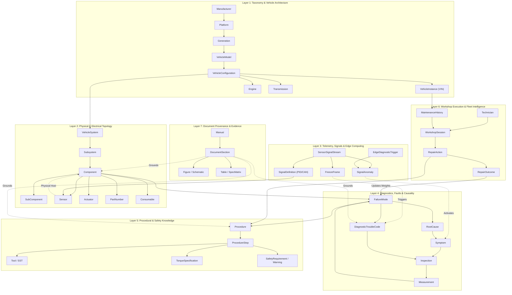
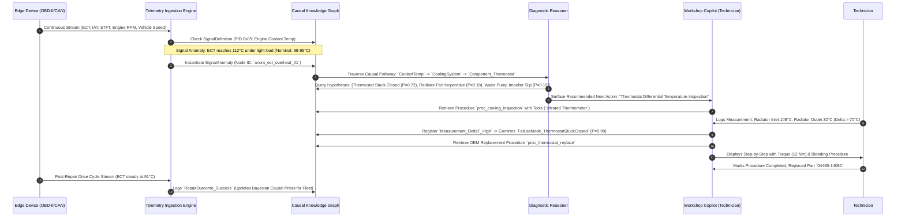

# RFC-003: Canonical Automotive Knowledge Ontology

| Metadata | Details |
| :--- | :--- |
| **RFC ID** | RFC-003 |
| **Title** | Canonical Automotive Knowledge Ontology for MechAI Platform |
| **Author** | Founding Systems Architect |
| **Status** | Proposed / Foundational Architecture |
| **Target Systems** | Ingestion Engine, Knowledge Graph Engine, Edge Device Telemetry Engine, Diagnostic Reasoner, Workshop OS |
| **Dependencies** | ADR-0001 (Knowledge Graph Core), RFC-001 (Ingestion Architecture), PR-002 (Domain Entities & Contracts) |

---

## 1. Executive Summary & Problem Context

MechAI is not a text summarizer or a diagnostic chatbot; it is an **automotive intelligence operating system**. Modern vehicle diagnostics and repair require synthesizing three fundamentally distinct modalities of knowledge:

1. **Prescriptive OEM Documentation**: Workshop manuals, technical service bulletins (TSBs), wiring diagrams, torque tables, and diagnostic flowcharts (static, deterministic, prescriptive ground truth).
2. **Empirical Edge Telemetry**: Continuous CAN-bus streams, OBD-II PIDs, ECU freeze frames, and high-frequency oscilloscope signals from connected Edge Devices (dynamic, quantitative, noisy, real-time observational truth).
3. **Empirical Workshop Repair Outcomes**: Real-world technician interventions, replaced parts, verified root causes, labor durations, and post-repair recurrence telemetry (historical, probabilistic, empirical truth).

Historically, these three domains have lived in isolated data silos:
- Manuals are stored as unstructured PDFs or static HTML.
- Telemetry is dumped into time-series lakes disconnected from component schematics.
- Workshop records sit in proprietary Dealer Management Systems (DMS) as unstandardized free text.

```
+-----------------------------------------------------------------------------------+
|                           THE THREE KNOWLEDGE MODALITIES                          |
+-----------------------------------------------------------------------------------+
|  [ OEM Documentation ]       [ Live Vehicle Telemetry ]   [ Workshop Outcomes ]   |
|  - Workshop Manuals          - OBD-II / UDS Streams       - Replaced Components   |
|  - Wiring Schematics         - High-Speed CAN Data        - Confirmed Root Causes |
|  - Torque Specs & DTCs       - ECU Freeze Frames          - Technician Feedback   |
+--------------+---------------------------+--------------------------+-------------+
               |                           |                          |
               +---------------------------v--------------------------+
                                           |
                    +----------------------v----------------------+
                    |        CANONICAL AUTOMOTIVE ONTOLOGY        |
                    |                 (RFC-003)                   |
                    |  - Unified Causal Knowledge Graph           |
                    |  - Physics-Grounded Relationship Topology   |
                    |  - Live Signal -> Component Bridge          |
                    |  - Bi-temporal Epistemic Evidence Engine    |
                    +---------------------------------------------+
```

### The Architectural Mandate
This RFC defines the **Canonical Automotive Knowledge Ontology** for MechAI. Every downstream engine—the Document Ingestion Pipeline, the Vector-Graph Hybrid Retriever, the Causal Diagnostic Engine, the Edge Telemetry Processor, and the Workshop Technician Copilot—will build upon, query, and mutate this singular ontological model.

---

## 2. Core Architectural Principles & Epistemic Foundations

### 2.1 Principle 1: Causal Physics Over Statistical Correlation
Vehicle systems obey strict laws of thermodynamics, fluid dynamics, electromagnetism, and mechanical kinematics. If an engine exhibits a lean condition ($O_2$ sensor voltage low, positive short-term fuel trim $>25\%$), the ontology must represent the physical failure pathways (e.g., unmetered air ingress via vacuum leak OR inadequate fuel delivery via clogged injector OR faulty mass airflow calibration) rather than naive text embeddings.

### 2.2 Principle 2: Strict Separation of T-Box (Terminology) and A-Box (Assertions)
- **T-Box (Structural Ontology & Class Model)**: Generic automotive concepts, component physics, system topologies, diagnostic decision graphs, and OEM procedure templates (e.g., `Toyota_2JZ_GTE`, `Component_Thermostat`, `FailureMode_StuckClosed`).
- **A-Box (Instance & Observational Graph)**: Specific physical vehicles, active work orders, time-stamped telemetry frames, and concrete technician actions (e.g., `VIN_JT2JA82J8R0001234`, `Session_2026_08_06_001`, `Reading_ECT_108C_Timestamp_1722988800`).

### 2.3 Principle 3: Bi-Temporal Grounding and Epistemic Versioning
Every assertion in the knowledge graph maintains two temporal dimensions:
1. **Valid Time**: The real-world window during which the fact is true (e.g., a specific part revision superseded on `2024-06-01`, or an engine overheating event occurring from `14:23:00` to `14:26:30`).
2. **Transaction Time**: The exact timestamp when MechAI ingested or inferred the fact into the knowledge base.

### 2.4 Principle 4: Explicit Provenance Chain (`SourceRef`)
No node, edge, or probabilistic weight may exist without an unbroken chain of custody:
$$\text{Assertion} = \langle \text{Fact}, \text{SourceRef}, \text{Confidence}, \text{EpistemicTier}, \text{Timestamp} \rangle$$
Where $\text{SourceRef}$ anchors to a PDF bounding box, a CAN-bus frame index, or a signed technician authorization.

---

## 3. High-Level Ontology Architecture Diagrams

### 3.1 Global Domain Layer Topology



---

### 3.2 The Unified Telemetry-to-Repair Diagnostic Pipeline

The core product capability of MechAI is bridging live telemetry directly to workshop repair execution through a deterministic causal pathway:



---

## 4. Formal Entity Specifications

### 4.1 Taxonomy & Architecture Layer

#### `Manufacturer`
- **Definition**: Automotive manufacturing corporate entity or OEM brand.
- **Attributes**:
  - `manufacturer_id`: `URN` (e.g., `urn:mechai:mfr:toyota`)
  - `name`: `String` (e.g., `"Toyota Motor Corporation"`)
  - `country`: `ISO-3166-1-Alpha-2` (e.g., `"JP"`)
  - `divisions`: `List[String]` (e.g., `["Lexus", "Gazoo Racing"]`)
- **Constraints**: Unique `manufacturer_id`.

#### `Platform`
- **Definition**: Modular vehicular architecture/chassis sharing structural hardpoints and electrical architecture.
- **Attributes**:
  - `platform_id`: `URN` (e.g., `urn:mechai:plat:tnga_k`)
  - `name`: `String` (e.g., `"TNGA-K"`)
  - `manufacturer_id`: `Ref[Manufacturer]`
  - `architecture_voltage`: `Float` (e.g., `12.0`, `48.0`, `400.0`, `800.0` V)
  - `network_topologies`: `List[Enum]` (`CAN_2_0B`, `CAN_FD`, `LIN`, `FLEXRAY`, `AUTOMOTIVE_ETHERNET`)

#### `VehicleModel` & `Generation`
- **Definition**: Commercial vehicle model and specific generational engineering iteration.
- **Attributes**:
  - `model_id`: `URN` (e.g., `urn:mechai:model:toyota:supra`)
  - `generation_id`: `URN` (e.g., `urn:mechai:gen:toyota:supra:a80`)
  - `generation_code`: `String` (e.g., `"A80"`, `"MK4"`)
  - `year_start`: `Integer`
  - `year_end`: `Optional[Integer]`
- **Constraints**: `year_end >= year_start`.

#### `VehicleConfiguration` (Trim / Variant)
- **Definition**: Distinct factory specification combining body style, engine, transmission, driveline, and market destination.
- **Attributes**:
  - `config_id`: `URN` (e.g., `urn:mechai:cfg:toyota:supra:a80:us_tt_6mt`)
  - `generation_id`: `Ref[Generation]`
  - `engine_id`: `Ref[Engine]`
  - `transmission_id`: `Ref[Transmission]`
  - `drive_type`: `Enum` (`FWD`, `RWD`, `AWD`, `FOUR_WD`)
  - `market`: `Enum` (`USDM`, `JDM`, `EDM`, `GLOBAL`)

#### `VehicleInstance` (Physical Asset / VIN)
- **Definition**: Concrete physical vehicle operating in the real world with a unique chassis number.
- **Attributes**:
  - `vin`: `String[17]` (ISO 3779 compliant, uppercase alphanumeric)
  - `config_id`: `Ref[VehicleConfiguration]`
  - `manufacture_date`: `Date`
  - `odometer_reading`: `Quantity[Distance]` (e.g., `142,500 km`)
  - `edge_device_id`: `Optional[URN]` (Linked active hardware telematics dongle)
  - `state_of_health`: `Float` (0.0 to 1.0)
- **Constraints**: Globally unique 17-character VIN with valid check-digit verification.

---

### 4.2 Physical & Electrical Topology Layer

#### `VehicleSystem` & `Subsystem`
- **Definition**: Functional physical domains of the vehicle.
- **Attributes**:
  - `system_id`: `URN` (e.g., `urn:mechai:sys:powertrain:cooling`)
  - `name`: `String` (e.g., `"Engine Thermal Management & Cooling"`)
  - `domain`: `Enum` (`POWERTRAIN`, `CHASSIS`, `ELECTRICAL`, `HVAC`, `BODY`, `ADAS_SAFETY`, `BRAKING`)
  - `parent_system_id`: `Optional[Ref[VehicleSystem]]`

#### `Component` & `SubComponent`
- **Definition**: Physical part, assembly, or module that performs a discrete vehicular function.
- **Attributes**:
  - `component_id`: `URN` (e.g., `urn:mechai:comp:thermostat_housing_assembly`)
  - `name`: `String` (e.g., `"Thermostat Housing Assembly"`)
  - `system_id`: `Ref[VehicleSystem]`
  - `physical_location`: `String` (e.g., `"Front lower engine block, water inlet bypass junction"`)
  - `material_composition`: `List[String]` (e.g., `["Die-cast Aluminum", "Bimetallic Spring"]`)
  - `operating_temperature_range`: `Tuple[Quantity[Temp], Quantity[Temp]]` (e.g., `(-40°C, 130°C)`)
  - `operating_pressure_range`: `Optional[Tuple[Quantity[Pressure], Quantity[Pressure]]]`
  - `expected_lifespan_km`: `Optional[Integer]`

#### `Sensor` (Transducer Specialization of Component)
- **Inherits From**: `Component`
- **Attributes**:
  - `sensor_id`: `URN` (e.g., `urn:mechai:sensor:engine_coolant_temp_1`)
  - `sensing_principle`: `Enum` (`THERMISTOR_NTC`, `HALL_EFFECT`, `PIEZOELECTRIC`, `VARIABLE_RELUCTANCE`, `OPTICAL`, `POTENTIOMETER`, `WIDEBAND_ZIRCONIA`)
  - `electrical_range`: `Tuple[Quantity[Voltage], Quantity[Voltage]]` (e.g., `(0.1V, 4.9V)`)
  - `physical_unit`: `Enum` (`DEG_C`, `KPA`, `RPM`, `VOLTS`, `LAMBDA`, `G_FORCE`, `MM_SEC`)
  - `transfer_function`: `String` (Mathematical formula or lookup matrix mapping Voltage to Physical Units)
  - `reference_voltage`: `Quantity[Voltage]` (e.g., `5.0V VREF`)

#### `Actuator` (Controlled Physical Output Specialization)
- **Inherits From**: `Component`
- **Attributes**:
  - `actuator_id`: `URN` (e.g., `urn:mechai:act:variable_valve_timing_solenoid_bank1`)
  - `control_type`: `Enum` (`PWM_DUTY_CYCLE`, `DIGITAL_ON_OFF`, `STEPPER_MOTOR`, `H_BRIDGE_DC`, `HYDRAULIC_SOLENOID`)
  - `drive_current_max`: `Quantity[Current]` (e.g., `2.5A`)
  - `default_de-energized_state`: `String` (e.g., `"Normally Closed / Retarded Timing"`)

---

### 4.3 Telemetry, Signals & Edge Computing Layer

```
+-----------------------------------------------------------------------------------+
|                        TELEMETRY METROLOGY HIERARCHY                              |
+-----------------------------------------------------------------------------------+
|  [ SignalDefinition ]                                                             |
|  - Standard: SAE J1979 (OBD-II) / ISO 14229 (UDS) / Custom OEM CAN               |
|  - PID / CAN Frame ID / Bit Position / Mask / Scaling Formula                     |
+-----------------------------------------+-----------------------------------------+
                                          |
                                          v
+-----------------------------------------+-----------------------------------------+
|  [ SensorSignalStream ]                                                           |
|  - Ingested Time-Series Stream: (Timestamp_ms, Raw_Value, Physical_Value)        |
+-----------------------------------------+-----------------------------------------+
                                          |
                                          v
+-----------------------------------------+-----------------------------------------+
|  [ SignalAnomaly ]                                                                |
|  - Classification: OUT_OF_BOUNDS | STUCK_IN_RANGE | THERMAL_DRIFT | NOISE_SPIKE   |
+-----------------------------------------+-----------------------------------------+
                                          |
                                          v
+-----------------------------------------+-----------------------------------------+
|  [ FreezeFrame Snapshot ]                                                         |
|  - Multi-Signal Vector at DTC Ignition: (RPM, Load, ECT, Speed, Fuel Trim, Spark) |
+-----------------------------------------------------------------------------------+
```

#### `SignalDefinition`
- **Definition**: Metrological specification mapping digital bus telegrams into physical engineering units.
- **Attributes**:
  - `signal_id`: `URN` (e.g., `urn:mechai:sig:obd:pid_05_ect` or `urn:mechai:sig:can:0x2c4:eng_rpm`)
  - `protocol`: `Enum` (`SAE_J1979_OBD2`, `ISO_14229_UDS`, `SAE_J1939_HD`, `PROPRIETARY_CAN`)
  - `can_message_id`: `Optional[HexInt]` (e.g., `0x2C4`)
  - `service_mode`: `Optional[HexInt]` (e.g., `0x01` for Live Data, `0x02` for Freeze Frame, `0x22` for UDS ReadDataByIdentifier)
  - `parameter_id`: `HexInt` (e.g., `0x05`)
  - `bit_start`: `Integer`
  - `bit_length`: `Integer`
  - `byte_order`: `Enum` (`BIG_ENDIAN_MOTOROLA`, `LITTLE_ENDIAN_INTEL`)
  - `scaling_factor`: `Float` (e.g., `1.0`)
  - `offset`: `Float` (e.g., `-40.0`)
  - `unit`: `Enum` (`DEG_C`, `RPM`, `KPA`, `PERCENT`, `KPH`, `MG_STROKE`)
  - `min_phys_val`: `Float`
  - `max_phys_val`: `Float`
  - `sampling_rate_nominal_hz`: `Float` (e.g., `10.0` Hz)

#### `SensorSignalStream`
- **Definition**: Real-time or recorded time-series partition emitted by an Edge Device.
- **Attributes**:
  - `stream_id`: `UUIDv7` (Time-sortable UUID)
  - `vehicle_instance_id`: `Ref[VehicleInstance]`
  - `signal_id`: `Ref[SignalDefinition]`
  - `start_time`: `Timestamp_UTC_Microseconds`
  - `end_time`: `Timestamp_UTC_Microseconds`
  - `sample_count`: `Integer`
  - `mean_value`: `Float`
  - `min_value`: `Float`
  - `max_value`: `Float`
  - `std_deviation`: `Float`
  - `raw_data_uri`: `URI` (Reference to parquet/time-series columnar chunk)

#### `SignalAnomaly`
- **Definition**: Statistically or physically invalid deviation detected in live telemetry by Edge reasoning algorithms.
- **Attributes**:
  - `anomaly_id`: `UUIDv7`
  - `stream_id`: `Ref[SensorSignalStream]`
  - `anomaly_type`: `Enum` (`OUT_OF_BOUNDS_HIGH`, `OUT_OF_BOUNDS_LOW`, `STUCK_IN_RANGE`, `EXCESSIVE_RATE_OF_CHANGE`, `FREQUENCY_DRIFT`, `CROSS_SENSOR_PLAUSIBILITY_VIOLATION`, `BUS_DROPOUT`)
  - `trigger_timestamp`: `Timestamp_UTC_Microseconds`
  - `severity_score`: `Float` (0.0 to 1.0)
  - `observed_value`: `Float`
  - `expected_baseline`: `Tuple[Float, Float]`
  - `duration_ms`: `Integer`

#### `FreezeFrame`
- **Definition**: Diagnostic vector recording comprehensive vehicle operating parameters captured by the ECU at the precise instant a fault was confirmed.
- **Attributes**:
  - `freeze_frame_id`: `UUIDv7`
  - `vehicle_instance_id`: `Ref[VehicleInstance]`
  - `triggering_dtc_id`: `Ref[DiagnosticTroubleCode]`
  - `timestamp`: `Timestamp_UTC`
  - `odometer`: `Quantity[Distance]`
  - `captured_signals`: `Dict[SignalDefinitionURN, Float]` (e.g., `{"pid:05": 114.0, "pid:0C": 2450.0, "pid:04": 68.5, "pid:0D": 85.0}`)

---

### 4.4 Diagnostics, Faults & Causal Layer

```
+-----------------------------------------------------------------------------------+
|                           CAUSAL DIAGNOSTIC ONTOLOGY                              |
+-----------------------------------------------------------------------------------+
|  [ RootCause ]              -> Fundamental physics degradation mechanism           |
|         |                                                                         |
|         v                                                                         |
|  [ FailureMode ]            -> Component-level fault state (e.g., Stuck Closed)   |
|         |                                                                         |
|         +-------------------+--------------------+                                |
|         |                                        |                                |
|         v                                        v                                |
|  [ DiagnosticTroubleCode ]               [ Symptom ]                              |
|  - ECU Threshold Trigger                 - Physical / Sensor Observation          |
|  - ISO/SAE Code                          - Human or Signal Anomaly                |
|         |                                        |                                |
|         +-------------------+--------------------+                                |
|                             |                                                     |
|                             v                                                     |
|                      [ Inspection ]                                               |
|                      - Physical Test Routine                                      |
|                             |                                                     |
|                             v                                                     |
|                      [ Measurement ]                                              |
|                      - Quantitative Value vs Tolerance Gate                       |
|                             |                                                     |
|                             v                                                     |
|                     [ RepairProcedure ]                                           |
+-----------------------------------------------------------------------------------+
```

#### `RootCause`
- **Definition**: The fundamental underlying physical, chemical, electrical, or software genesis of failure.
- **Attributes**:
  - `root_cause_id`: `URN` (e.g., `urn:mechai:cause:thermal_fatigue_solder_joint`)
  - `description`: `String` (e.g., `"Thermal cycling fatigue fracture in relay solder joint"`)
  - `physics_domain`: `Enum` (`MECHANICAL_WEAR`, `THERMAL_DEGRADATION`, `GALVANIC_CORROSION`, `ELECTROMIGRATION`, `FLUID_CONTAMINATION`, `DIELECTRIC_BREAKDOWN`, `SOFTWARE_OVERFLOW`)

#### `FailureMode`
- **Definition**: Specific dysfunctional state of a component that disrupts nominal system operation.
- **Attributes**:
  - `failure_mode_id`: `URN` (e.g., `urn:mechai:fm:thermostat_stuck_closed`)
  - `component_id`: `Ref[Component]`
  - `name`: `String` (e.g., `"Thermostat Valve Stuck Closed"` )
  - `fmea_severity`: `Integer` (1 to 10 SAE J1739)
  - `fmea_occurrence`: `Integer` (1 to 10)
  - `fmea_detection`: `Integer` (1 to 10)
  - `prior_probability`: `Float` (Base rate probability $P(FM)$ across fleet)

#### `DiagnosticTroubleCode` (DTC)
- **Definition**: Standardized 5-character (OBD-II / SAE J2012) or 7-character (ISO 14229 UDS) fault identifier logged by vehicular ECUs.
- **Attributes**:
  - `dtc_id`: `URN` (e.g., `urn:mechai:dtc:p0128:toyota`)
  - `code`: `String` (e.g., `"P0128"`)
  - `standard`: `Enum` (`SAE_J2012`, `ISO_14229_UDS`, `OEM_ENHANCED`)
  - `category`: `Enum` (`POWERTRAIN_P`, `CHASSIS_C`, `BODY_B`, `NETWORK_U`)
  - `title`: `String` (e.g., `"Coolant Thermostat (Coolant Temperature Below Thermostat Regulating Temperature)"`)
  - `set_conditions`: `String` (e.g., `"Engine run time > 15 min and ECT < 75°C when vehicle speed > 60 km/h"`)
  - `mil_illuminated`: `Boolean`

#### `Symptom`
- **Definition**: Observable physical, audible, thermal, dynamic, or telemetry-derived manifestation of an underlying fault.
- **Attributes**:
  - `symptom_id`: `URN` (e.g., `urn:mechai:sym:cabin_heater_blows_cold`)
  - `category`: `Enum` (`NOISE_VIBRATION_HARSHNESS`, `DRIVABILITY_PERFORMANCE`, `THERMAL_OVERHEATING`, `FLUID_LEAK`, `VISUAL_SMOKE_LIGHT`, `ELECTRICAL_INOPERATIVE`, `TELEMETRY_ANOMALY`)
  - `description`: `String` (e.g., `"Cabin heater core blows ambient air despite engine at operating temperature"`)
  - `trigger_conditions`: `List[String]`

#### `Inspection` & `Measurement`
- **Definition**: A deterministic test method and its quantitative output verifying component integrity.
- **Attributes (`Inspection`)**:
  - `inspection_id`: `URN` (e.g., `urn:mechai:insp:thermostat_opening_bench_test`)
  - `name`: `String`
  - `target_component_id`: `Ref[Component]`
  - `required_tool_ids`: `List[Ref[Tool]]`
- **Attributes (`Measurement`)**:
  - `measurement_id`: `UUIDv7`
  - `inspection_id`: `Ref[Inspection]`
  - `observed_value`: `Float`
  - `unit`: `String`
  - `nominal_value`: `Float`
  - `min_tolerance`: `Float`
  - `max_tolerance`: `Float`
  - `outcome`: `Enum` (`PASS`, `FAIL`, `MARGINAL`, `INCONCLUSIVE`)

---

### 4.5 Procedural, Tooling & Safety Layer

#### `Procedure` & `ProcedureStep`
- **Definition**: Prescribed sequence of atomic physical operations required to inspect, service, remove, install, or calibrate a component.
- **Attributes (`Procedure`)**:
  - `procedure_id`: `URN` (e.g., `urn:mechai:proc:toyota:2jz:water_pump_replace`)
  - `title`: `String`
  - `procedure_type`: `Enum` (`REMOVAL`, `INSTALLATION`, `INSPECTION`, `DIAGNOSTIC_TREE`, `OVERHAUL`, `CALIBRATION`, `FLUSH_FILL`)
  - `estimated_labor_hours`: `Float`
  - `skill_level`: `Enum` (`APPRENTICE`, `JOURNEYMAN`, `MASTER_DIAGNOSTICIAN`)
- **Attributes (`ProcedureStep`)**:
  - `step_id`: `URN` (e.g., `urn:mechai:step:toyota:2jz:water_pump:04`)
  - `step_number`: `Integer`
  - `instruction_text`: `String` (e.g., `"Torque the four water pump pulley bolts in a crisscross pattern."`)
  - `preconditions`: `List[String]` (e.g., `"Engine cold (< 40°C)", "Coolant drained"`)
  - `postconditions`: `List[String]`

#### `Tool` & `SpecialServiceTool` (SST)
- **Definition**: Equipment, hand tools, digital diagnostic meters, and OEM-specific fixtures.
- **Attributes**:
  - `tool_id`: `URN` (e.g., `urn:mechai:tool:toyota_sst_09213_70011`)
  - `name`: `String`
  - `is_sst`: `Boolean`
  - `oem_tool_number`: `Optional[String]` (e.g., `"09213-70011"`)
  - `category`: `Enum` (`HAND_TOOL`, `SPECIAL_SERVICE_TOOL`, `DIAGNOSTIC_SCANNER`, `OSCILLOSCOPE`, `PRESSURE_GAUGE`, `MULTIMETER`, `HOIST_LIFT`)

#### `TorqueSpecification`
- **Definition**: Mechanical tightening parameter governing fastener pre-load.
- **Attributes**:
  - `torque_id`: `URN`
  - `fastener_description`: `String` (e.g., `"Cylinder Head Hex Flange Bolt"`)
  - `nominal_value`: `Float`
  - `unit`: `Enum` (`NM`, `FT_LB`, `IN_LB`, `KG_M`)
  - `min_value`: `Optional[Float]`
  - `max_value`: `Optional[Float]`
  - `angle_degrees`: `Optional[Float]` (e.g., `90° + 90°` torque-to-yield)
  - `condition`: `Enum` (`DRY`, `ENGINE_OIL_LUBRICATED`, `THREAD_LOCKER_BLUE`, `ANTI_SEIZE`)
  - `is_yield_fastener`: `Boolean` (Must replace on removal)

#### `SafetyRequirement` & `Warning`
- **Definition**: Mandatory safety hazard isolation and PPE protocols.
- **Attributes**:
  - `warning_id`: `URN`
  - `severity`: `Enum` (`DANGER_IMMINENT_DEATH`, `WARNING_SEVERE_INJURY`, `CAUTION_MINOR_INJURY_DAMAGE`, `NOTICE_EQUIPMENT_INTEGRITY`)
  - `hazard_type`: `Enum` (`HIGH_VOLTAGE_ORANGE_CABLE`, `HIGH_PRESSURE_FUEL_RAIL`, `EXPLOSIVE_SRS_AIRBAG`, `HOT_PRESSURIZED_COOLANT`, `CARCINOGENIC_BRAKE_DUST`, `CRUSH_PINCH_POINT`)
  - `required_ppe`: `List[String]` (e.g., `["Class 0 1000V Insulated Gloves", "Face Shield"]`)
  - `isolation_procedure`: `Optional[String]` (e.g., `"Remove High Voltage Service Plug Grip and wait 10 min for capacitor discharge"`)

---

### 4.6 Workshop Execution & Fleet Intelligence Layer

```
+-----------------------------------------------------------------------------------+
|                        WORKSHOP CLOSED-LOOP LEARNING                              |
+-----------------------------------------------------------------------------------+
|  [ VehicleInstance (VIN) ]                                                        |
|         |                                                                         |
|         v                                                                         |
|  [ WorkshopSession ]      -> Technician: Certified Master Tech                   |
|         |                 -> Initial Complaints: Symptoms & DTCs                  |
|         v                                                                         |
|  [ RepairAction ]         -> Implemented Procedure: `proc_replace_injector_cyl1`  |
|         |                 -> Replaced Part: `pn_23209_46031`                      |
|         v                                                                         |
|  [ RepairOutcome ]        -> Verified: Post-repair telematics STFT normal (0.8%)  |
|         |                 -> Recurrence Metric: 0 returns in 90 days              |
|         v                                                                         |
|  [ Bayesian Prior Update ] -> P(Injector Clog | P0301, Lean STFT) updated         |
+-----------------------------------------------------------------------------------+
```

#### `Technician` & `WorkshopSession`
- **Definition**: Active workshop entity managing the physical repair lifecycle of a vehicle asset.
- **Attributes (`Technician`)**:
  - `technician_id`: `URN`
  - `name`: `String`
  - `certification_level`: `Enum` (`ASE_MASTER`, `OEM_CERTIFIED_GOLD`, `GENERAL_TECHNICIAN`)
  - `experience_years`: `Integer`
- **Attributes (`WorkshopSession`)**:
  - `session_id`: `UUIDv7`
  - `vehicle_instance_id`: `Ref[VehicleInstance]`
  - `technician_id`: `Ref[Technician]`
  - `opened_at`: `Timestamp_UTC`
  - `closed_at`: `Optional[Timestamp_UTC]`
  - `intake_odometer`: `Quantity[Distance]`
  - `customer_complaints`: `List[String]`

#### `RepairAction` & `RepairOutcome`
- **Definition**: The executed remediation and its empirical real-world validation metric.
- **Attributes (`RepairAction`)**:
  - `action_id`: `UUIDv7`
  - `session_id`: `Ref[WorkshopSession]`
  - `procedure_id`: `Ref[Procedure]`
  - `installed_part_numbers`: `List[Ref[PartNumber]]`
  - `actual_labor_minutes`: `Integer`
  - `technician_notes`: `String`
- **Attributes (`RepairOutcome`)**:
  - `outcome_id`: `UUIDv7`
  - `action_id`: `Ref[RepairAction]`
  - `status`: `Enum` (`SUCCESS_CONFIRMED`, `FAULT_RECURRED_30_DAYS`, `MISDIAGNOSIS_WRONG_PART`, `COLLATERAL_DAMAGE_INCURRED`, `INCOMPLETE`)
  - `telemetry_validation_score`: `Float` (1.0 = All anomalous signals restored to nominal baselines)
  - `recurrence_timestamp`: `Optional[Timestamp_UTC]`

---

## 5. Formal Relationship & Semantic Predicate Matrix

The relationships between entities form a **Directed Multigraph with Typed Edge Properties**.

| Predicate | Source Entity | Target Entity | Cardinality | Semantics | Edge Properties |
| :--- | :--- | :--- | :--- | :--- | :--- |
| `EQUIPPED_WITH_ENGINE` | `VehicleConfiguration` | `Engine` | $N:1$ | Vehicle specification carries engine | `is_standard: bool` |
| `HAS_SUBSYSTEM` | `VehicleSystem` | `Subsystem` | $1:N$ | Top-level system divides into subsystems | `order_index: int` |
| `CONTAINS_COMPONENT` | `Subsystem` | `Component` | $1:N$ | Physical hosting hierarchy | `is_critical: bool` |
| `MEASURED_BY_SENSOR` | `Component` | `Sensor` | $1:N$ | Sensor transduces component physical state | `placement_zone: str` |
| `CONTROLS_ACTUATOR` | `Subsystem` | `Actuator` | $1:N$ | Control module drives actuator | `bus_channel: str` |
| `EMITS_SIGNAL` | `Sensor` | `SignalDefinition` | $1:N$ | Physical sensor outputs digital bus signal | `sampling_hz: float` |
| `DETECTED_ANOMALY` | `SensorSignalStream` | `SignalAnomaly` | $1:N$ | Edge stream registers telemetry breach | `confidence: float` |
| `CAUSES_FAILURE_MODE` | `RootCause` | `FailureMode` | $N:M$ | Fundamental physics drives component fault | `causal_weight: float` |
| `MANIFESTS_AS_SYMPTOM` | `FailureMode` | `Symptom` | $N:M$ | Fault state exhibits observable behavior | `conditional_prob: float` |
| `TRIGGERS_DTC` | `FailureMode` | `DiagnosticTroubleCode` | $N:M$ | Fault causes ECU to log trouble code | `freeze_frame_required: bool` |
| `CORRELATES_WITH_ANOMALY`| `SignalAnomaly` | `Symptom` | $N:M$ | Telemetry anomaly maps to symptom | `cross_corr_r2: float` |
| `VERIFIED_BY_INSPECTION`| `FailureMode` | `Inspection` | $N:M$ | Inspection deterministically verifies fault | `discriminative_power: float`|
| `PRODUCES_MEASUREMENT` | `Inspection` | `Measurement` | $1:N$ | Concrete test execution output | `device_calibrated: bool` |
| `REMEDIED_BY` | `FailureMode` | `Procedure` | $N:M$ | Standard repair procedure fixes fault | `efficacy_rating: float` |
| `EXECUTES_STEP` | `Procedure` | `ProcedureStep` | $1:N$ | Procedure contains ordered steps | `step_index: int` |
| `REQUIRES_TOOL` | `ProcedureStep` | `Tool` | $N:M$ | Step requires hand or special tool | `optional: bool` |
| `FASTENED_WITH` | `ProcedureStep` | `TorqueSpecification`| $N:M$ | Step specifies fastener tightening spec | `stage_index: int` |
| `MANDATES_SAFETY` | `ProcedureStep` | `SafetyRequirement` | $N:M$ | Step mandates hazard protocol | `lockout_required: bool` |
| `EXECUTED_DURING` | `RepairAction` | `WorkshopSession` | $N:1$ | Action performed within shop session | `timestamp: datetime` |
| `RESULTED_IN` | `RepairAction` | `RepairOutcome` | $1:1$ | Concrete empirical outcome of repair | `verified_by_vin: str` |
| `EVIDENCED_BY_MANUAL` | `Procedure` | `DocumentSection` | $N:M$ | Grounding provenance to OEM documentation| `page_bbox: BoundingBox` |

---

## 6. Identifier Namespacing, Canonical URIs & Versioning

To ensure global uniqueness across distributed edge devices and cloud ingestion engines, all ontological entities employ a **Deterministic Uniform Resource Name (URN)** standard:

$$\text{urn:mechai}:\langle \text{domain} \rangle:\langle \text{entity\_type} \rangle:\langle \text{namespace} \rangle:\langle \text{id} \rangle$$

### 6.1 URN Schema Rules
1. **Manufacturer Scope**: `urn:mechai:tax:mfr:toyota`
2. **Vehicle Configuration**: `urn:mechai:tax:cfg:toyota:supra:a80:us_tt_6mt`
3. **Component Taxonomy**: `urn:mechai:topo:comp:cooling:thermostat_assembly`
4. **OEM Part Numbers**: `urn:mechai:part:toyota:04465-14080`
5. **Standard DTCs**: `urn:mechai:diag:dtc:sae:p0301`
6. **Signal Definitions**: `urn:mechai:tele:sig:obd2:pid_05_ect`
7. **OEM Procedures**: `urn:mechai:proc:toyota:rm390u:br_14_front_brakes`

### 6.2 Ephemeral vs Canonical Instances
- **Canonical Class Entities (T-Box)** use deterministic human-readable URNs generated via cryptographic hashing of canonical semantic tuples:
  $$\text{ID} = \text{MD5}(\text{make} + \text{model} + \text{year} + \text{component\_name})$$
- **Physical Instances & Telemetry Events (A-Box)** use **UUIDv7** (time-sortable, millisecond precision), ensuring collision-free distributed event generation on offline Edge Devices.

---

## 7. Epistemic Evidence & Bayesian Confidence Model

MechAI distinguishes between *definitional truth*, *empirical observation*, and *probabilistic inference*. Every edge asserting a causal relationship carries a dynamic Bayesian epistemic weight.

```
+-----------------------------------------------------------------------------------+
|                        EPISTEMIC CONFIDENCE HIERARCHY                             |
+-----------------------------------------------------------------------------------+
|  Tier 0: Physical Laws & Formal Logic   |  Confidence = 1.000                     |
|  - Conservation of energy, Ohm's law,   |  - Non-negotiable physical axioms       |
|    torque geometry                      |                                         |
+-----------------------------------------+-----------------------------------------+
|  Tier 1: Prescriptive OEM Manuals       |  Confidence = 0.950 - 0.999             |
|  - Factory specs, wiring pinouts,       |  - Authoritative manufacturer specs     |
|    official torque ratings              |                                         |
+-----------------------------------------+-----------------------------------------+
|  Tier 2: Physical Sensor Telemetry      |  Confidence = 0.800 - 0.980             |
|  - Quantitative CAN/OBD-II readings     |  - High SNR live telemetry              |
|  - Verified digital multimeters         |  - Discounted by sensor noise & age     |
+-----------------------------------------+-----------------------------------------+
|  Tier 3: Closed-Loop Workshop History   |  Confidence = 0.600 - 0.950             |
|  - Fleet-validated repair outcomes      |  - Empirical Bayesian frequency updates |
+-----------------------------------------+-----------------------------------------+
|  Tier 4: Statistical / Model Inference  |  Confidence = 0.100 - 0.850             |
|  - AI-generated diagnostic hypotheses   |  - Prior hypotheses needing inspection  |
+-----------------------------------------------------------------------------------+
```

### 7.1 Dynamic Bayesian Causal Formulation
When diagnosing a fault given a set of active Symptoms $S$, Diagnostic Codes $D$, and Live Telemetry Anomalies $A$, the posterior probability of a specific Failure Mode $FM_k$ is evaluated using Bayesian inference over the knowledge graph:

$$P(FM_k \mid S, D, A) = \frac{P(S, D, A \mid FM_k) \cdot P(FM_k)}{\sum_{j} P(S, D, A \mid FM_j) \cdot P(FM_j)}$$

Where:
- $P(FM_k)$ is the fleet base-rate prior for component failure given vehicle mileage, operating age, and environmental climate.
- $P(S, D, A \mid FM_k)$ is the likelihood of observing the specific symptom-DTC-anomaly vector given that $FM_k$ is physically present, parameterized by OEM fault matrices and adjusted by closed-loop workshop repair outcomes.
- After a technician completes a `RepairAction` and the outcome is logged, the prior $P(FM_k)$ and conditional likelihoods are dynamically updated via conjugate Dirichlet-Multinomial Bayesian updates across the entire fleet graph.

---

## 8. Design Rationale & Architectural Decisions

### 8.1 Why Labeled Property Graph (LPG) with Semantic Constraints?
- **Relational Databases (RDBMS)** fail at arbitrary graph traversals (e.g., finding all components that share a single ground splice across 5 wiring sub-harnesses requires 12 JOINs).
- **Pure Vector Databases (RAG)** fail because vector similarity cannot perform deductive causal inference (e.g., an overheating engine might be semantically similar to a heater blowing cold air, but only a causal graph knows that a stuck-closed thermostat causes *both* simultaneously).
- **MechAI Solution**: A Hybrid Architecture combining **Labeled Property Graphs** (Neo4j / NetworkX / Graph Databases for multi-hop causal reasoning) backed by strongly typed **Pydantic/Rust** validation engines.

### 8.2 Why Bridge Telemetry Directly to Component Nodes?
If an edge dongle detects an anomaly in Engine Coolant Temperature (PID 0x05), it does not simply record a text log. It traverses:
$$\text{Signal(PID 0x05)} \xrightarrow{\text{EMITTED\_BY}} \text{Sensor(ECT)} \xrightarrow{\text{MOUNTED\_ON}} \text{Component(Thermostat Housing)} \xrightarrow{\text{CAUSES}} \text{FailureMode(Stuck Closed)}$$
This enables zero-latency conversion of raw physical CAN-bus bits into actionable OEM diagnostic work orders.

---

## 9. Future Expansion Strategy

1. **High-Bandwidth Edge Waveform Streaming**: Integration of 200 kHz digital storage oscilloscope (DSO) signals for injector current ramping, secondary ignition waveforms, and CAN-bus physical layer voltage reflections (detecting frayed wiring before total failure).
2. **Acoustic & Vibration Machine Learning Nodes**: Fast Fourier Transform (FFT) vibrational frequency nodes mapping accelerometer harmonics directly to bearing race defects, valve tap, and differential gear whine.
3. **Vehicle Digital Twin Instantiation**: Auto-generating a synchronized digital graph twin for every registered VIN that aggregates its complete historical telemetry, weather exposure, driver aggressiveness score, and service history.

---

## 10. Potential Weaknesses & Architectural Mitigations

| Vulnerability / Failure Mode | Real-World Automotive Risk | Architectural Safeguard / Mitigation |
| :--- | :--- | :--- |
| **1. Sensor Fault vs Process Fault** | A faulty ECT sensor reads 130°C, causing false diagnosis of engine mechanical overheating. | **Cross-Sensor Plausibility Gates**: Reasoning engine verifies related thermodynamic signals (e.g., If ECT is 130°C but Cylinder Head Temp is 85°C and Radiator Fan is OFF, flag `Sensor_ECT_Fault` rather than mechanical failure). |
| **2. TSB & OEM Revision Drift** | OEM updates a torque specification or supersedes an injector part number due to fire hazard. | **Bi-Temporal Validity Windows**: Graph queries always filter by `valid_time_start <= current_date <= valid_time_end`. Superseded parts automatically reroute to replacement part nodes. |
| **3. Ground Loop & Multi-ECU Confounding** | A rusted chassis ground creates 15 unrelated DTCs across transmission, ABS, and radio modules. | **Electrical Topology Graph Analysis**: Diagnostic Reasoner detects common power/ground nodes across concurrent multi-DTC clusters and isolates the shared physical splice. |
| **4. Graph Scale & Edge Explosion** | Modeling every vehicle trim over 50 years creates billions of redundant nodes. | **Inheritance Deduplication (T-Box Flyweight Pattern)**: Subsystems and components inherit standard SAE properties from platform parents unless explicitly overridden by OEM generation deltas. |

---

## 11. Summary Recommendation

RFC-003 establishes the formal foundation for MechAI's long-term technical moat:
- **Pure domain models** (PR-002) provide local data integrity.
- **Ingestion contracts** (PR-002) govern multi-stage parsing.
- **RFC-003 Canonical Ontology** bridges static manuals, live Edge CAN telemetry, and technician workshop feedback into a unified, physics-grounded automotive intelligence operating system.

**Next Immediate Step**: Review and ratify RFC-003 into the canonical architectural documentation (`docs/architecture/`).
