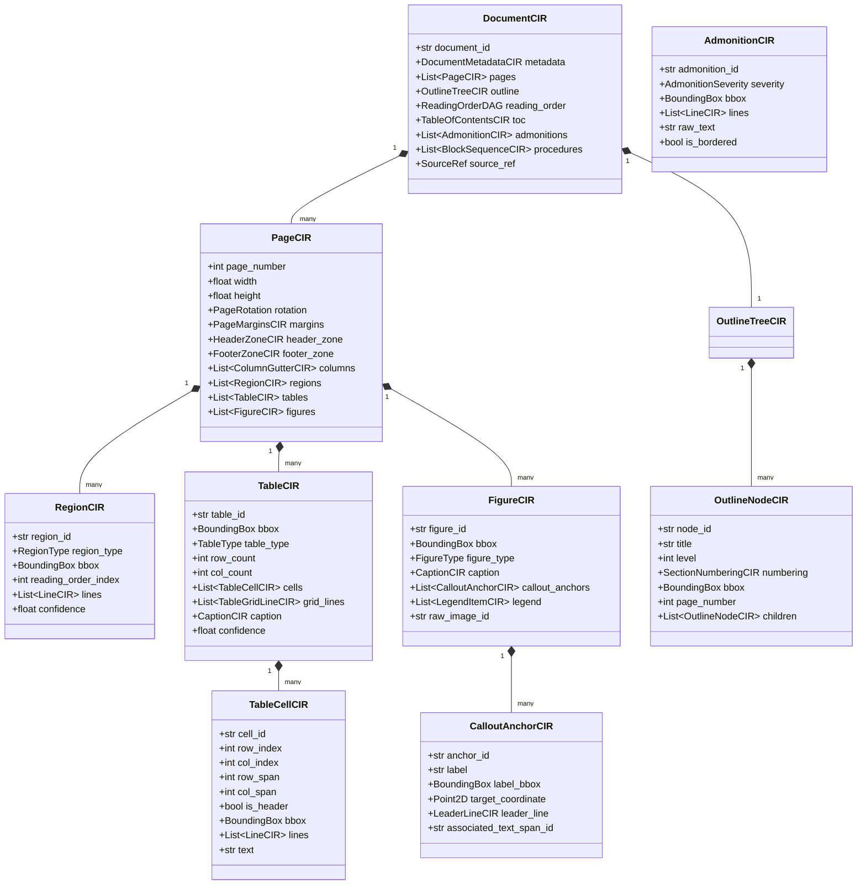

# RFC-006: Document Intelligence Layer & Canonical Intermediate Representation (CIR)

| Metadata | Details |
| :--- | :--- |
| **RFC ID** | RFC-006 |
| **Title** | Document Intelligence Layer & Canonical Intermediate Representation (CIR) |
| **Author** | Chief Document Intelligence Architect |
| **Status** | Approved / Foundational Architecture |
| **Target Systems** | Ingestion Pipeline (Stages 1.5–4.5), Document Scrubbing Engine, Geometry & Layout Engine, Canonical Intermediate Representation (CIR), Downstream Domain Extractors |
| **Dependencies** | PR-001 (Engineering Foundation), PR-002 (Domain Entities & Contracts), RFC-003 (Canonical Automotive Knowledge Ontology), Stage 1 Parser (PyMuPDF / Docling) |
| **Supersedes / Resolves** | RFC-005 Gap Analysis (G-01 through G-23) |

---

## 1. Executive Summary & Architectural Mission

### 1.1 The Missing Architectural Layer
The MechAI ingestion pipeline transforms raw unstructured workshop manuals into an actionable, physics-grounded Automotive Knowledge Graph (RFC-003). In Stage 1, we implemented the raw **PDF Parsing Engine** (`PyMuPDFParser`, `DoclingParser`), which extracts primitive tokens: words with bounding boxes, font attributes, raw bitmap images, and page dimensions.

However, real automotive workshop manuals (e.g., Suzuki K10B, Maruti-Suzuki F8D, Toyota/Denso FSMs) are not flat streams of prose. They are dense, multi-column, structurally rigid technical artifacts containing:
- Interleaved multi-column repair procedures,
- Unbordered specification grids and bearing selection matrices,
- Running headers with compound section-page identifiers (`0B-2`, `6E1-12`),
- Exploded technical diagrams with detached numeric/alphabetic callout anchors (`(1)`, `[A]`),
- High-consequence safety admonitions (`DANGER`, `WARNING`, `CAUTION`, `NOTE`),
- Proprietary or legacy symbol fonts (`PSOspsbsymbb`) that encode critical units ($\Omega$, $\pm$, $\circ$).

Stage 1 produces raw character-coordinate primitives. Downstream Stage 5+ extractors expect clean domain objects (Procedures, TorqueSpecs, DTCs). If domain extractors operate directly on raw Stage 1 streams, they inherit linearized multi-column chaos, shattered table cells, unmapped callout numbers, and corrupted symbol encodings (RFC-005 G-01 through G-03).

```
+----------------------------------------------------------------------------------------------------+
|                                    MECHAI INGESTION ARCHITECTURE                                   |
+----------------------------------------------------------------------------------------------------+
|  [ Stage 1: Raw PDF Parser ]                                                                       |
|  - Character, word, and image coordinate extraction                                                |
|  - Engine: PyMuPDF / Docling Hybrid Engine                                                         |
+--------------------------------------------------+-------------------------------------------------+
                                                   | Raw Coordinates & Tokens (ParsedDocument)
                                                   v
+----------------------------------------------------------------------------------------------------+
|  [ THE DOCUMENT INTELLIGENCE LAYER ] <--- THIS RFC (RFC-006)                                      |
|  - Typography & Glyph Normalization Engine                                                         |
|  - Geometric Region Decomposition & Margin/Zone Classifier                                         |
|  - 2D Spatial Reading-Order Graph & Multi-Column Sorter                                            |
|  - Unbordered & Bordered Table Reconstruction Matrix (R-Tree / Dual Projection)                   |
|  - Structural Outline, Visual TOC, & Section Hierarchy Builder                                     |
|  - Safety Admonition & Procedure Boundary Delimiter                                                |
|  - Diagram-Callout Spatial Anchor Associator                                                       |
+--------------------------------------------------+-------------------------------------------------+
                                                   | Canonical Intermediate Representation (CIR)
                                                   v
+----------------------------------------------------------------------------------------------------+
|  [ Stages 5–16: Domain & Knowledge Generation ]                                                    |
|  - Automotive Entity Extraction (Torque, Tools, DTCs, Part Numbers)                                |
|  - Causal Knowledge Graph Synthesis (RFC-003) & Boundary-Aware Semantic Chunking                    |
+----------------------------------------------------------------------------------------------------+
```

### 1.2 Core Mandate: Pure Structural Intelligence
The **Document Intelligence Layer** is purely agnostic of automotive domain semantics:
- It understands what a **table** is, but does not know what a "crankshaft clearance" is.
- It understands what a **callout arrow** or **numbered anchor** is, but does not know what a "thermostat housing" is.
- It understands what a **procedure step sequence** is, but does not know what an "intake manifold" is.
- It understands what a **safety callout box** is, but does not know the chemical toxicity of glycol coolant.

It operates with the mechanical rigor of an advanced document layout analysis engine (akin to the core layout analysis engines inside Adobe Acrobat Professional or Google Document AI), producing an immutable, deterministic, and queryable **Canonical Intermediate Representation (CIR)**.

---

## 2. Architectural Design Principles

The Document Intelligence Layer is governed by eight non-negotiable architectural axioms:

1. **Geometric Grounding Before Semantic Labeling**: Every structural determination must begin with physical coordinate geometry (bounding boxes, Voronoi tessellations, whitespace projections, Delaunay triangulations) before textual patterns are considered.
2. **Determinism First, Vision/ML Fallback**: Deterministic computational geometry (R-Trees, ray-casting, projection profiles) is the primary path. Deep-learning layout segmentation is invoked only when geometric confidence falls below calibrated thresholds.
3. **Unbroken Sub-Pixel Provenance Chain**: Every node in the CIR—from an entire chapter down to a single table cell or callout label—must maintain an unbroken mathematical link to its parent page coordinates (`BoundingBox`) and byte stream offset.
4. **Directed Acyclic Reading Order (DAG)**: Reading order is not a flat array; it is a Directed Acyclic Graph (DAG) representing topological visual flow, column bridges, floating sidebars, and diagram wraps.
5. **Lossless Typographic Preservation**: Font metrics (family, point size, weight, line pitch, baseline offset, character spacing) are preserved and normalized to enable robust hierarchical classification.
6. **Explicit Epistemic Confidence**: Every segmented region, reconstructed table, and associated callout carries an epistemic confidence score ($c \in [0.0, 1.0]$) derived from geometric alignment metrics, not arbitrary heuristics.
7. **Zero Automotive Semantics**: No class, attribute, or regex in this layer may refer to engines, transmissions, torque, DTCs, or automotive components. It models purely typographical and spatial grammar.
8. **Immutability and Pure Functional Pipeline**: Every stage receives an immutable CIR snapshot and outputs an enriched, validated immutable CIR snapshot.

---

## 3. High-Level Architecture & Layer Topology

```mermaid
flowchart TD
    subgraph S1["Stage 1: Raw Physical Extraction"]
        RAW["ParsedDocument (Tokens, BBoxes, Images, Fonts)"]
    end

    subgraph DIL["Document Intelligence Layer (Stages 1.5 - 4.5)"]
        direction TB
        S15["Stage 1.5: Glyph & Typography Normalizer\n- PSOspsbsymbb Unicode Transcoder\n- Font Metric & Weight Classifier\n- Dehyphenation & Baseline Joiner"]
        
        S20["Stage 2.0: Geometric Zoning & Layout Classifier\n- Header / Footer / Margin Exclusion\n- Recursive XY-Cut & Column Gutter Slicer\n- Visual Region Segmenter (Text, Image, Table, Box)"]
        
        S25["Stage 2.5: 2D Spatial Reading-Order Graph Builder\n- Multi-Column Topological Sorter\n- Floating Diagram Wrap-Around Tracer\n- Reading Flow DAG Generator"]
        
        S30["Stage 3.0: Table Reconstruction Matrix\n- Dual-Projection Profile (Bordered & Borderless)\n- R-Tree Spatial Grid & Cell Matrix Rebuilder\n- Multi-Span & Column Header Resolver"]
        
        S35["Stage 3.5: Visual & Syntactic TOC Engine\n- Dot-Leader & Tabular TOC Synthesizer\n- PDF Bookmark vs Visual TOC Reconciler\n- Target Page & Section Mapping Graph"]
        
        S40["Stage 4.0: Structural Hierarchy & Boundary Tree\n- Typographic Scale Hierarchy Clustering\n- Compound Section-Page ID Resolver (0B-2, 6E1)\n- Generic Procedure & Admonition Boundary Delimiter"]
        
        S45["Stage 4.5: Diagram-Callout Spatial Associator\n- Callout Number/Letter Token Isolator\n- Convex Hull Diagram Bounding & Anchor Graph\n- Spatial Proximity & Leader-Line Linker"]
    end

    subgraph CIR_OUT["Canonical Intermediate Representation (CIR)"]
        CIR["DocumentCIR (Universal Canonical Document Artifact)"]
    end

    RAW --> S15
    S15 --> S20
    S20 --> S25
    S25 --> S30
    S30 --> S35
    S35 --> S40
    S40 --> S45
    S45 --> CIR
```



---

## 4. Canonical Intermediate Representation (CIR) Specification

The **Canonical Intermediate Representation (CIR)** is the universal, domain-agnostic data structure that represents the complete visual, typographical, geometric, and logical structure of a technical document.

### 4.1 CIR Class Topology Diagram



### 4.2 CIR Formal Data Contracts (Pydantic v2 Schema)

```python
"""Canonical Intermediate Representation (CIR) contracts.

Universal, domain-agnostic document representation schema.
All models are strictly typed, immutable (frozen=True), and fully validated.
"""

from __future__ import annotations

from enum import IntEnum, StrEnum
from typing import Annotated, Literal

from pydantic import BaseModel, ConfigDict, Field

# ---------------------------------------------------------------------------
# Fundamental Primitives & Geometry
# ---------------------------------------------------------------------------


class Point2D(BaseModel):
    """2D Cartesian point in points (1/72 inch) relative to page top-left."""

    model_config = ConfigDict(frozen=True, extra="forbid")

    x: float
    y: float


class BoundingBox(BaseModel):
    """Axis-aligned bounding box (left, top, right, bottom) in points."""

    model_config = ConfigDict(frozen=True, extra="forbid")

    left: float
    top: float
    right: float
    bottom: float

    @property
    def width(self) -> float:
        return max(0.0, self.right - self.left)

    @property
    def height(self) -> float:
        return max(0.0, self.bottom - self.top)

    @property
    def center_x(self) -> float:
        return (self.left + self.right) / 2.0

    @property
    def center_y(self) -> float:
        return (self.top + self.bottom) / 2.0

    def intersects(self, other: BoundingBox) -> bool:
        return not (
            self.right < other.left
            or self.left > other.right
            or self.bottom < other.top
            or self.top > other.bottom
        )

    def union(self, other: BoundingBox) -> BoundingBox:
        return BoundingBox(
            left=min(self.left, other.left),
            top=min(self.top, other.top),
            right=max(self.right, other.right),
            bottom=max(self.bottom, other.bottom),
        )

    def intersection_area(self, other: BoundingBox) -> float:
        ix1 = max(self.left, other.left)
        iy1 = max(self.top, other.top)
        ix2 = min(self.right, other.right)
        iy2 = min(self.bottom, other.bottom)
        if ix2 > ix1 and iy2 > iy1:
            return (ix2 - ix1) * (iy2 - iy1)
        return 0.0

    def iou(self, other: BoundingBox) -> float:
        inter = self.intersection_area(other)
        union = (self.width * self.height) + (other.width * other.height) - inter
        return inter / union if union > 0.0 else 0.0


class PageRotation(IntEnum):
    """Page rendering orientation in clockwise degrees."""

    ROTATE_0 = 0
    ROTATE_90 = 90
    ROTATE_180 = 180
    ROTATE_270 = 270


class ExtractionMethod(StrEnum):
    """Mechanism producing an extracted entity."""

    DETERMINISTIC_GEOMETRY = "deterministic_geometry"
    TYPOGRAPHIC_RULE = "typographic_rule"
    PROJECTION_PROFILE = "projection_profile"
    R_TREE_SPATIAL = "r_tree_spatial"
    HYBRID_DOCLING = "hybrid_docling"
    OCR_VISION = "ocr_vision"


class SourceRef(BaseModel):
    """Immutable audit trail grounding an entity in raw bytes and geometry."""

    model_config = ConfigDict(frozen=True, extra="forbid")

    page_number: Annotated[int, Field(ge=1)]
    bbox: BoundingBox | None = None
    extraction_method: ExtractionMethod = ExtractionMethod.DETERMINISTIC_GEOMETRY
    confidence: Annotated[float, Field(ge=0.0, le=1.0)] = 1.0


# ---------------------------------------------------------------------------
# Typographical Tokens & Lines
# ---------------------------------------------------------------------------


class TextAlignment(StrEnum):
    """Horizontal alignment of a text line or cell."""

    LEFT = "left"
    CENTER = "center"
    RIGHT = "right"
    JUSTIFIED = "justified"


class GlyphCIR(BaseModel):
    """Normalized character glyph with exact physical bounding."""

    model_config = ConfigDict(frozen=True, extra="forbid")

    char: str = Field(min_length=1, max_length=2)
    original_char: str
    bbox: BoundingBox
    font_name: str
    font_size: float
    is_bold: bool
    is_italic: bool
    is_symbol_font: bool
    unicode_point: int


class WordCIR(BaseModel):
    """Cohesive lexical word formed by adjacent glyphs."""

    model_config = ConfigDict(frozen=True, extra="forbid")

    text: str = Field(min_length=1)
    bbox: BoundingBox
    font_name: str
    font_size: float
    is_bold: bool
    is_italic: bool
    glyphs: tuple[GlyphCIR, ...] = Field(default_factory=tuple)
    source_ref: SourceRef


class LineCIR(BaseModel):
    """Horizontal typographical text baseline line."""

    model_config = ConfigDict(frozen=True, extra="forbid")

    line_id: str = Field(min_length=1)
    text: str = Field(min_length=1)
    bbox: BoundingBox
    baseline_y: float
    alignment: TextAlignment = TextAlignment.LEFT
    font_name: str
    font_size: float
    is_bold: bool
    words: tuple[WordCIR, ...] = Field(default_factory=tuple)
    source_ref: SourceRef


# ---------------------------------------------------------------------------
# Layout Regions & Classifications
# ---------------------------------------------------------------------------


class RegionType(StrEnum):
    """Classified semantic layout type of a geometric region."""

    PARAGRAPH = "paragraph"
    SECTION_HEADING = "section_heading"
    RUNNING_HEADER = "running_header"
    RUNNING_FOOTER = "running_footer"
    PAGE_NUMBER = "page_number"
    TABLE_REGION = "table_region"
    FIGURE_REGION = "figure_region"
    CAPTION = "caption"
    ADMONITION = "admonition"
    PROCEDURE_STEP = "procedure_step"
    LIST_ITEM = "list_item"
    TOC_BLOCK = "toc_block"
    INDEX_BLOCK = "index_block"
    SIDEBAR = "sidebar"
    NOISE = "noise"


class RegionCIR(BaseModel):
    """Homogeneous rectangular visual region of content."""

    model_config = ConfigDict(frozen=True, extra="forbid")

    region_id: str = Field(min_length=1)
    region_type: RegionType
    bbox: BoundingBox
    page_number: Annotated[int, Field(ge=1)]
    column_index: Annotated[int, Field(ge=0)] = 0
    reading_order_index: Annotated[int, Field(ge=0)]
    lines: tuple[LineCIR, ...] = Field(default_factory=tuple)
    confidence: Annotated[float, Field(ge=0.0, le=1.0)] = 1.0
    source_ref: SourceRef

    @property
    def text(self) -> str:
        return "\n".join(line.text for line in self.lines)


# ---------------------------------------------------------------------------
# Tables & Cell Matrices
# ---------------------------------------------------------------------------


class TableType(StrEnum):
    """Structural typology of a technical table."""

    EXPLICIT_GRID = "explicit_grid"  # Visual border lines present
    BORDERLESS_ALIGNED = "borderless_aligned"  # Position-aligned whitespace columns
    MATRIX_SPECIFICATION = "matrix_specification"  # Two-dimensional lookup grid
    KEY_VALUE_PAIR = "key_value_pair"  # 2-column parameter/value list


class TableCellCIR(BaseModel):
    """Single cell inside a reconstructed table."""

    model_config = ConfigDict(frozen=True, extra="forbid")

    cell_id: str = Field(min_length=1)
    row_index: Annotated[int, Field(ge=0)]
    col_index: Annotated[int, Field(ge=0)]
    row_span: Annotated[int, Field(ge=1)] = 1
    col_span: Annotated[int, Field(ge=1)] = 1
    is_header: bool = False
    bbox: BoundingBox
    text: str = ""
    lines: tuple[LineCIR, ...] = Field(default_factory=tuple)
    source_ref: SourceRef


class TableCIR(BaseModel):
    """Fully reconstructed two-dimensional tabular data structure."""

    model_config = ConfigDict(frozen=True, extra="forbid")

    table_id: str = Field(min_length=1)
    table_type: TableType
    bbox: BoundingBox
    page_number: Annotated[int, Field(ge=1)]
    row_count: Annotated[int, Field(ge=1)]
    col_count: Annotated[int, Field(ge=1)]
    headers: tuple[tuple[str, ...], ...] = Field(default_factory=tuple)
    cells: tuple[TableCellCIR, ...] = Field(default_factory=tuple)
    caption_region_id: str | None = None
    confidence: Annotated[float, Field(ge=0.0, le=1.0)] = 1.0
    source_ref: SourceRef

    def get_cell(self, row: int, col: int) -> TableCellCIR | None:
        for cell in self.cells:
            if cell.row_index == row and cell.col_index == col:
                return cell
        return None


# ---------------------------------------------------------------------------
# Figures, Diagrams, Callouts, & Legends
# ---------------------------------------------------------------------------


class FigureType(StrEnum):
    """Visual nature of a technical illustration."""

    EXPLODED_ASSEMBLY = "exploded_assembly"
    SCHEMATIC_CIRCUIT = "schematic_circuit"
    CROSS_SECTION = "cross_section"
    FLOWCHART = "flowchart"
    CONNECTOR_PINOUT = "connector_pinout"
    PHOTOGRAPH = "photograph"
    GRAPH_OR_CHART = "graph_or_chart"
    GENERIC_ILLUSTRATION = "generic_illustration"


class LeaderLineCIR(BaseModel):
    """Vector line connecting a callout token to a physical diagram feature."""

    model_config = ConfigDict(frozen=True, extra="forbid")

    start_point: Point2D
    end_point: Point2D
    has_arrowhead: bool = False


class CalloutAnchorCIR(BaseModel):
    """Numeric or alphabetic label referencing an illustration sub-feature."""

    model_config = ConfigDict(frozen=True, extra="forbid")

    anchor_id: str = Field(min_length=1)
    label: str = Field(min_length=1)  # e.g., "(1)", "1", "A", "[a]"
    label_bbox: BoundingBox
    target_point: Point2D | None = None
    leader_line: LeaderLineCIR | None = None
    confidence: Annotated[float, Field(ge=0.0, le=1.0)] = 1.0
    associated_text_span_id: str | None = None


class LegendItemCIR(BaseModel):
    """Entry in a diagram legend mapping a callout symbol to a description."""

    model_config = ConfigDict(frozen=True, extra="forbid")

    symbol: str = Field(min_length=1)
    description: str = Field(min_length=1)
    bbox: BoundingBox


class FigureCIR(BaseModel):
    """Technical figure or schematic with embedded callouts and legend."""

    model_config = ConfigDict(frozen=True, extra="forbid")

    figure_id: str = Field(min_length=1)
    figure_type: FigureType
    bbox: BoundingBox
    page_number: Annotated[int, Field(ge=1)]
    raw_image_id: str | None = None
    caption_region_id: str | None = None
    callout_anchors: tuple[CalloutAnchorCIR, ...] = Field(default_factory=tuple)
    legend_items: tuple[LegendItemCIR, ...] = Field(default_factory=tuple)
    confidence: Annotated[float, Field(ge=0.0, le=1.0)] = 1.0
    source_ref: SourceRef


# ---------------------------------------------------------------------------
# Admonitions & Generic Procedure Blocks
# ---------------------------------------------------------------------------


class AdmonitionSeverity(StrEnum):
    """Standard ISO/SAE technical documentation admonition level."""

    DANGER = "danger"
    WARNING = "warning"
    CAUTION = "caution"
    NOTICE = "notice"
    NOTE = "note"
    IMPORTANT = "important"


class AdmonitionCIR(BaseModel):
    """Highlighted safety alert or informational callout box."""

    model_config = ConfigDict(frozen=True, extra="forbid")

    admonition_id: str = Field(min_length=1)
    severity: AdmonitionSeverity
    bbox: BoundingBox
    page_number: Annotated[int, Field(ge=1)]
    raw_text: str = Field(min_length=1)
    is_bordered: bool = False
    enclosing_region_id: str
    source_ref: SourceRef


class StepOrdinalCIR(BaseModel):
    """Parsed step prefix identifier."""

    model_config = ConfigDict(frozen=True, extra="forbid")

    raw_ordinal: str = Field(min_length=1)  # e.g., "1)", "1.", "(1)", "•", "a."
    normalized_index: int
    is_bullet: bool = False


class ProcedureStepCIR(BaseModel):
    """Single discrete step inside a procedural block."""

    model_config = ConfigDict(frozen=True, extra="forbid")

    step_id: str = Field(min_length=1)
    ordinal: StepOrdinalCIR
    bbox: BoundingBox
    text: str = Field(min_length=1)
    sub_steps: tuple[ProcedureStepCIR, ...] = Field(default_factory=tuple)
    source_ref: SourceRef


class BlockSequenceCIR(BaseModel):
    """Ordered procedural action sequence delimited from document prose."""

    model_config = ConfigDict(frozen=True, extra="forbid")

    sequence_id: str = Field(min_length=1)
    title: str = Field(min_length=1)
    category_hint: str  # e.g., "REMOVAL", "INSTALLATION", "INSPECTION", "ADJUSTMENT"
    bbox: BoundingBox
    start_page: Annotated[int, Field(ge=1)]
    end_page: Annotated[int, Field(ge=1)]
    steps: tuple[ProcedureStepCIR, ...] = Field(default_factory=tuple)
    is_continuation: bool = False
    source_ref: SourceRef


# ---------------------------------------------------------------------------
# Outline Hierarchy & Navigation Graph
# ---------------------------------------------------------------------------


class SectionNumberingCIR(BaseModel):
    """Formal section code extracted from typography."""

    model_config = ConfigDict(frozen=True, extra="forbid")

    raw_code: str = Field(min_length=1)  # e.g., "0B-2", "6E1", "3.2.1"
    primary_section: str  # "0B", "6E1", "3"
    sub_section: str | None = None  # "2", "1"
    sequence_rank: int = 0


class OutlineNodeCIR(BaseModel):
    """Hierarchical node in the document outline tree."""

    model_config = ConfigDict(frozen=True, extra="forbid")

    node_id: str = Field(min_length=1)
    title: str = Field(min_length=1)
    level: Annotated[int, Field(ge=1)]
    numbering: SectionNumberingCIR | None = None
    page_number: Annotated[int, Field(ge=1)]
    bbox: BoundingBox
    parent_id: str | None = None
    children: tuple[OutlineNodeCIR, ...] = Field(default_factory=tuple)
    source_ref: SourceRef


class TocEntryCIR(BaseModel):
    """Single item reconstructed from visual or PDF-native TOC."""

    model_config = ConfigDict(frozen=True, extra="forbid")

    title: str = Field(min_length=1)
    target_page: Annotated[int, Field(ge=1)]
    level: Annotated[int, Field(ge=1)] = 1
    section_code: str | None = None
    source_ref: SourceRef


class TableOfContentsCIR(BaseModel):
    """Complete document index navigation table."""

    model_config = ConfigDict(frozen=True, extra="forbid")

    entries: tuple[TocEntryCIR, ...] = Field(default_factory=tuple)
    is_detected: bool = True
    is_from_pdf_bookmarks: bool = False


# ---------------------------------------------------------------------------
# Reading Order & Page Aggregations
# ---------------------------------------------------------------------------


class ReadingOrderDAG(BaseModel):
    """Directed Acyclic Graph defining legal linear reading sequences."""

    model_config = ConfigDict(frozen=True, extra="forbid")

    ordered_region_ids: tuple[str, ...] = Field(default_factory=tuple)
    edge_transitions: tuple[tuple[str, str], ...] = Field(default_factory=tuple)


class ColumnGutterCIR(BaseModel):
    """Vertical whitespace gutter separating multi-column layouts."""

    model_config = ConfigDict(frozen=True, extra="forbid")

    left: float
    right: float
    top: float
    bottom: float


class PageCIR(BaseModel):
    """Completely structured and classified single document page."""

    model_config = ConfigDict(frozen=True, extra="forbid")

    page_number: Annotated[int, Field(ge=1)]
    width: float
    height: float
    rotation: PageRotation = PageRotation.ROTATE_0
    header_region_id: str | None = None
    footer_region_id: str | None = None
    columns: tuple[ColumnGutterCIR, ...] = Field(default_factory=tuple)
    regions: tuple[RegionCIR, ...] = Field(default_factory=tuple)
    tables: tuple[TableCIR, ...] = Field(default_factory=tuple)
    figures: tuple[FigureCIR, ...] = Field(default_factory=tuple)
    admonitions: tuple[AdmonitionCIR, ...] = Field(default_factory=tuple)


class DocumentCIR(BaseModel):
    """Universal Canonical Intermediate Representation of the document."""

    model_config = ConfigDict(frozen=True, extra="forbid")

    document_id: str = Field(min_length=1)
    source_path: str | None = None
    total_pages: Annotated[int, Field(ge=1)]
    pages: tuple[PageCIR, ...] = Field(default_factory=tuple)
    outline: tuple[OutlineNodeCIR, ...] = Field(default_factory=tuple)
    toc: TableOfContentsCIR = Field(default_factory=lambda: TableOfContentsCIR(is_detected=False))
    procedures: tuple[BlockSequenceCIR, ...] = Field(default_factory=tuple)
    admonitions: tuple[AdmonitionCIR, ...] = Field(default_factory=tuple)
    reading_order: ReadingOrderDAG = Field(default_factory=ReadingOrderDAG)
    source_ref: SourceRef
```

---

## 5. Detailed Sub-Stage Pipeline Breakdown

The Document Intelligence Layer executes in seven sequential, deterministic sub-stages:

```
ParsedDocument
  │
  ├─► [Stage 1.5: Typography & Glyph Normalizer]
  │      └─► Unicode repair, font weight classification, word dehyphenation
  │
  ├─► [Stage 2.0: Geometric Zoning & Layout Classifier]
  │      └─► Header/footer clipping, XY-cut column slicing, visual block segmentation
  │
  ├─► [Stage 2.5: 2D Spatial Reading-Order Graph Builder]
  │      └─► Multi-column sorting, diagram wrap-around tracing, DAG construction
  │
  ├─► [Stage 3.0: Table Reconstruction Matrix]
  │      └─► Dual-projection profiling, R-Tree spatial cell grids, header matrix synthesis
  │
  ├─► [Stage 3.5: Visual & Syntactic TOC Engine]
  │      └─► Dot-leader synthesis, bookmark cross-correlation, page target resolution
  │
  ├─► [Stage 4.0: Structural Hierarchy & Boundary Tree]
  │      └─► Compound section ID parsing (0B-2), procedure & admonition delimiter
  │
  └─► [Stage 4.5: Diagram-Callout Spatial Associator]
         └─► Convex hull bounding, leader-line ray casting, anchor-text graph linking
  │
  ▼
DocumentCIR
```

---

### 5.1 Stage 1.5: Typography & Glyph Normalizer

#### Responsibilities & Math
1. **Symbol Font Transcoding (Resolving RFC-005 G-03)**:
   Legacy automotive PDFs created via Solaris Distiller or PScript5 encode technical symbols in non-standard single-byte encodings (e.g., `PSOspsbsymbb`, `Symbol`, `Wingdings`). A static mapping table transcodes raw character bytes into canonical Unicode:
   $$\text{Transcode}(c, f) = \begin{cases} \text{Unicode}(\text{Table}_{f}[c]) & \text{if } f \in \text{SymbolFonts} \\ c & \text{otherwise} \end{cases}$$
   Example mappings:
   - `0xB0` / `0x6F` in `PSOspsbsymbb` $\rightarrow$ `°` (`\u00B0`, Degree Celsius / Angle)
   - `0xB1` in `Symbol` $\rightarrow$ `±` (`\u00B1`, Plus-Minus Tolerance)
   - `0x57` in `Symbol` $\rightarrow$ `Ω` (`\u03A9`, Ohm Electrical Resistance)
   - `0x6D` in `Symbol` $\rightarrow$ `µ` (`\u00B5`, Microfarad / Micrometer)
2. **Font Weight & Style Classifier**:
   Normalized classification accounting for composite names:
   $$\text{is\_bold} \iff (\text{flags} \ \& \ 16 \neq 0) \lor (\text{regex}(\text{"Bold|Black|Heavy|B"})\in \text{font\_name})$$
   $$\text{is\_italic} \iff (\text{flags} \ \& \ 2 \neq 0) \lor (\text{regex}(\text{"Italic|Oblique|I"})\in \text{font\_name})$$
3. **Dehyphenation & Baseline Joiner (Resolving RFC-005 G-11)**:
   Joins split words across line wraps where:
   - Line $L_1$ ends with a trailing hyphen (`-` or `\u00AD`),
   - Line $L_2$ begins within the same vertical column band ($|x_{L_2, \text{left}} - x_{L_1, \text{left}}| < 10\text{ pt}$),
   - Distance $(y_{L_2, \text{top}} - y_{L_1, \text{bottom}}) < 1.5 \times \text{line\_height}$.

---

### 5.2 Stage 2.0: Geometric Zoning & Layout Classifier

#### Responsibilities & Math
1. **Header & Footer Zone Isolation (Resolving RFC-005 G-04)**:
   Calculates the page vertical bounding profile. Page regions inside the top $8\%$ ($y < 0.08 \times H$) and bottom $6\%$ ($y > 0.94 \times H$) are tested for repetitive running text patterns across pages:
   $$\text{JaccardSimilarity}(\text{Header}_{p}, \text{Header}_{p+1}) > 0.6 \implies \text{Classify}(\text{RUNNING\_HEADER})$$
2. **Recursive XY-Cut Column Partitioning (Resolving RFC-005 G-02)**:
   Computes horizontal and vertical projection profiles:
   $$H(y) = \sum_{i} \mathbb{I}(y \in [y_{i, \text{top}}, y_{i, \text{bottom}}])$$
   $$V(x) = \sum_{i} \mathbb{I}(x \in [x_{i, \text{left}}, x_{i, \text{right}}])$$
   Zero-valued valleys in $V(x)$ wider than $15\text{ pt}$ define column gutters. The page is partitioned recursively into homogeneous column bounding boxes.

---

### 5.3 Stage 2.5: 2D Spatial Reading-Order Graph Builder

#### Responsibilities & Math
1. **Multi-Column Topological Sorter (Resolving RFC-005 G-02)**:
   Constructs a Directed Acyclic Graph (DAG) over regions $R_i$:
   - For regions in the same column $k$: Edge $R_a \rightarrow R_b$ if $y_{a, \text{bottom}} < y_{b, \text{top}}$.
   - For column transition: Edge $R_{\text{last}, k} \rightarrow R_{\text{first}, k+1}$ if $x_{k, \text{right}} \le x_{k+1, \text{left}}$.
2. **Floating Diagram & Table Wrap-Around**:
   If a full-width figure or table spans across columns ($x_{\text{span}} > 0.7 \times W$), the topological sorter breaks column processing, visits the spanning entity, and then resumes below the entity baseline ($y_{\text{resume}} = y_{\text{entity, bottom}}$).

---

### 5.4 Stage 3.0: Table Reconstruction Matrix

#### Responsibilities & Math (Resolving RFC-005 G-01 & G-23)
1. **Dual-Projection Profiling for Borderless Tables**:
   For table regions with no vector grid lines, computes orthogonal projection histograms of word token coordinates.
   - Column separators = Valleys in $V(x)$ where $\min(V(x)) = 0$ over interval $\Delta x \ge 8\text{ pt}$.
   - Row separators = Valleys in $H(y)$ where $\min(H(y)) = 0$ over interval $\Delta y \ge 3\text{ pt}$.
2. **2D R-Tree Spatial Cell Indexing**:
   Builds an R-Tree index of all bounding boxes within the table boundary. For every grid intersection $[x_j, x_{j+1}] \times [y_i, y_{i+1}]$, queries intersecting text tokens to construct `TableCellCIR`.
3. **Multi-Span & Header Row Resolution**:
   If a cell span has width $> 1.5 \times \text{column\_width}$, it is merged as a `col_span > 1` header. Cells featuring bold typography or distinct background shading in the top row are marked `is_header = True`.

---

### 5.5 Stage 3.5: Visual & Syntactic TOC Engine

#### Responsibilities & Math (Resolving RFC-005 G-08)
1. **Dot-Leader Synthesizer**:
   Detects recurring dot-leader patterns (`. . . . . .` or `…`) connecting left-aligned section titles with right-aligned page numbers:
   $$\text{Regex}: \quad \text{r"^(?P<title>.+?)\s*(?:\.|\s){3,}\s*(?P<page>\d+)\s*$"}$$
2. **Landscape & Multi-Column TOC Sorter**:
   For training manuals (e.g., K10B p.2) where the TOC is rendered as side-by-side columns of `Topic | Page`, the engine groups adjacent horizontal token pairs into atomic `TocEntryCIR` structures instead of interleaving text.

---

### 5.6 Stage 4.0: Structural Hierarchy & Boundary Tree

#### Responsibilities & Math (Resolving RFC-005 G-04, G-05, G-17)
1. **Typographic Scale Hierarchy Clustering**:
   Clusters font sizes across the document using Gaussian Mixture or 1D K-Means into discrete structural tiers:
   - Tier 1 ($\ge 20\text{ pt}$, Bold): Document / Chapter Title
   - Tier 2 ($14\text{–}18\text{ pt}$, Bold): Section Header (e.g., "ENGINE MECHANICAL", "CONTENTS")
   - Tier 3 ($11\text{–}13\text{ pt}$, Bold): Subsection / Procedure Header (e.g., "REMOVAL", "INSTALLATION")
   - Tier 4 ($9\text{–}10\text{ pt}$, Bold): Sub-item / Safety Header (e.g., "CAUTION", "NOTE")
   - Tier 5 ($8\text{–}10\text{ pt}$, Regular): Body text / Step descriptions
2. **Compound Section-Page ID Parser**:
   Extracts OEM alphanumeric codes from headers/titles (e.g., `0B-2`, `6E1-12`, `3A-1`):
   $$\text{Regex}: \quad \text{r"\b(?P<sec>[0-9]{1,2}[A-Z]{1,2}[0-9]?)-(?P<pg>[0-9]{1,3})\b"}$$
3. **Generic Procedure & Admonition Delimiter**:
   - Identifies procedure boundaries via keyword anchors (`REMOVAL`, `INSTALLATION`, `INSPECTION`, `DISASSEMBLY`, `ADJUSTMENT`) followed by numbered/bulleted step sequences (`1)`, `2)`, `3)`).
   - Identifies admonition boundaries via bounding boxes surrounding keywords (`DANGER`, `WARNING`, `CAUTION`, `NOTE`).

---

### 5.7 Stage 4.5: Diagram-Callout Spatial Associator

#### Responsibilities & Math (Resolving RFC-005 G-06)
1. **Callout Label Isolator**:
   Isolates numeric/alphabetic tokens within diagram regions:
   $$\text{Regex}: \quad \text{r"^(?:\([0-9a-zA-Z]{1,2}\)|\[[0-9a-zA-Z]{1,2}\]|[0-9]{1,2}|[a-zA-Z])$"}$$
2. **Convex Hull Diagram Enclosure**:
   Computes the 2D convex hull of technical illustrations. Tokens located inside or within $20\text{ pt}$ of the convex hull are assigned as `CalloutAnchorCIR`.
3. **Text-Callout Spatial Linker**:
   Cross-references callout numbers occurring in adjacent procedure text (e.g., `"Remove bolt (1) and disconnect coupler (2)"`) with diagram anchors to create a bidirectional spatial link graph.

---

## 6. Stage Interfaces & Python Protocols

Following the MechAI architecture standards (`mechai.contracts.stages`), we define the formal `@runtime_checkable` protocols for the Document Intelligence Layer:

```python
"""Stage protocols for Document Intelligence Layer."""

from __future__ import annotations

from typing import Protocol, runtime_checkable

from mechai.contracts.cir import (
    AdmonitionCIR,
    BlockSequenceCIR,
    DocumentCIR,
    FigureCIR,
    OutlineNodeCIR,
    PageCIR,
    ReadingOrderDAG,
    TableCIR,
    TableOfContentsCIR,
)
from mechai.contracts.scrubbing import ParsedDocument


@runtime_checkable
class TypographyNormalizerProtocol(Protocol):
    """Stage 1.5: Transcode symbol fonts, classify font metrics, dehyphenate."""

    def normalize(self, document: ParsedDocument) -> ParsedDocument:
        """Transcode glyphs and normalize word baselines."""
        ...


@runtime_checkable
class GeometricLayoutZonerProtocol(Protocol):
    """Stage 2.0: Segment pages into geometric regions and isolate headers/footers."""

    def segment_layout(self, document: ParsedDocument) -> list[PageCIR]:
        """Perform recursive XY-cut and zone classification."""
        ...


@runtime_checkable
class ReadingOrderResolverProtocol(Protocol):
    """Stage 2.5: Build topological reading order DAG for multi-column layouts."""

    def resolve_reading_order(self, pages: list[PageCIR]) -> ReadingOrderDAG:
        """Resolve reading flow across multi-column boundaries."""
        ...


@runtime_checkable
class TableReconstructionProtocol(Protocol):
    """Stage 3.0: Reconstruct bordered and borderless tables into cell grids."""

    def reconstruct_tables(self, pages: list[PageCIR]) -> list[TableCIR]:
        """Extract 2D cell matrices from aligned whitespace and gridlines."""
        ...


@runtime_checkable
class TableOfContentsEngineProtocol(Protocol):
    """Stage 3.5: Synthesize visual and bookmark-based Table of Contents."""

    def extract_toc(self, pages: list[PageCIR]) -> TableOfContentsCIR:
        """Extract TOC hierarchy from dot-leaders and visual index pages."""
        ...


@runtime_checkable
class StructuralHierarchyBuilderProtocol(Protocol):
    """Stage 4.0: Build section tree, delimit procedures and admonition blocks."""

    def build_hierarchy(
        self,
        pages: list[PageCIR],
        toc: TableOfContentsCIR,
        reading_order: ReadingOrderDAG,
    ) -> tuple[tuple[OutlineNodeCIR, ...], tuple[BlockSequenceCIR, ...], tuple[AdmonitionCIR, ...]]:
        """Construct outline tree, procedure blocks, and admonitions."""
        ...


@runtime_checkable
class DiagramCalloutAssociatorProtocol(Protocol):
    """Stage 4.5: Link diagram callout labels to physical illustrations and text."""

    def associate_callouts(
        self,
        pages: list[PageCIR],
        figures: list[FigureCIR],
        procedures: tuple[BlockSequenceCIR, ...],
    ) -> list[FigureCIR]:
        """Build bidirectional anchor graph between callout labels and diagram features."""
        ...


@runtime_checkable
class DocumentIntelligenceEngineProtocol(Protocol):
    """End-to-end orchestrator for Document Intelligence Layer."""

    def process(self, raw_document: ParsedDocument) -> DocumentCIR:
        """Execute Stages 1.5 through 4.5 and output verified DocumentCIR."""
        ...
```

---

## 7. Failure Recovery, Resilient Fallbacks, & Confidence Calibration

### 7.1 Multi-Tiered Fallback Matrix

Technical documents exhibit high structural entropy. The engine implements a deterministic multi-tiered fallback architecture:

| Component | Tier 1 (Primary Deterministic) | Tier 2 (Geometric Projection Fallback) | Tier 3 (Deep-Learning / Vision Fallback) | Degradation Policy |
| :--- | :--- | :--- | :--- | :--- |
| **Glyph Normalization** | Unicode Character Map Table | Font-Family Glyph Fallback | Visual OCR Character Box | Emit unmapped glyph with flag `is_symbol_font=True` |
| **Column Slicing** | Recursive XY-Cut on Whitespace | Column Gutter Density Histogram | Docling Layout Segmentation | Treat page as single linear column ($c=0.5$) |
| **Table Extraction** | Vector Path Boundary Mesh | Dual-Projection Orthogonal Slicing | Deep Table Transformer (Docling) | Extract as raw text block with `RegionType.TABLE_REGION` |
| **TOC Extraction** | PDF Native Bookmark Tree | Regex Dot-Leader Pattern Matching | Multi-Column Tabular Index Slicer | Set `toc.is_detected=False`; infer outline from font sizes |
| **Callout Linking** | Leader Line Vector Raycasting | Radial Proximity Convex Hull | OCR Diagram Annotation | Preserve callout text in body; anchor `target_point=None` |

### 7.2 Epistemic Confidence Calibration

Every CIR artifact computes an explicit confidence metric ($c \in [0.0, 1.0]$) derived from physical geometric alignment:

1. **Table Reconstruction Confidence**:
   $$c_{\text{table}} = 0.4 \cdot \text{GridAlignmentScore} + 0.3 \cdot \text{CellOccupancyRate} + 0.3 \cdot \text{HeaderConsistency}$$
   where $\text{GridAlignmentScore} = 1.0 - \frac{\sigma_{\text{col\_widths}}}{\mu_{\text{col\_widths}}}$.
2. **Reading Order Confidence**:
   $$c_{\text{order}} = 1.0 - 0.5 \cdot \left(\frac{\text{InterlacedColumnViolations}}{\text{TotalTransitions}}\right)$$
3. **Callout Anchor Confidence**:
   $$c_{\text{callout}} = \begin{cases} 1.0 & \text{if leader line connects directly to feature} \\ 0.8 & \text{if within 15 pt of diagram convex hull} \\ 0.5 & \text{if textual proximity match only} \end{cases}$$

---

## 8. Verification & Testing Strategy

To adhere to the engineering standards of PR-001/PR-002, the Document Intelligence Layer must be 100% verified across three rigorous testing tiers:

```
+-----------------------------------------------------------------------------------+
|                            THREE-TIERED TESTING HARNESS                           |
+-----------------------------------------------------------------------------------+
|  [ Unit Tests (Synthetic Geometries) ]                                            |
|  - Synthetic SVG/PDF generation with known column gutters (1, 2, 3 columns)       |
|  - Bordered and unbordered table matrices with known cell values and spans        |
|  - PSOspsbsymbb symbol font transcoding fixtures                                  |
|  - Dot-leader synthetic TOC strings                                               |
+------------------------------------------+----------------------------------------+
                                           |
+------------------------------------------v----------------------------------------+
|  [ Golden Visual Layout Fixtures ]                                                |
|  - Suzuki K10B Engine Manual (93 pages): Landscape TOC, custom Suzuki font        |
|  - Suzuki F8D Workshop Manual (644 pages): Multi-column, 296 procedures           |
|  - Automated assertion: 0 interlaced column transitions on F8D pages 21-50       |
|  - Automated assertion: 100% table recovery on Periodic Maintenance Schedule     |
+------------------------------------------+----------------------------------------+
                                           |
+------------------------------------------v----------------------------------------+
|  [ Property-Based & Invariant Testing (Hypothesis) ]                             |
|  - Invariant 1: Total area of segmented regions <= Page Area                      |
|  - Invariant 2: No cycles in ReadingOrderDAG                                      |
|  - Invariant 3: TableCell row_span * col_span coverage == Table dimensions        |
|  - Invariant 4: Every CIR node has non-null SourceRef with valid page number      |
+-----------------------------------------------------------------------------------+
```

---

## 9. Performance Considerations & Latency Budgets

Automotive workshop manuals frequently exceed 600–1,500 pages (e.g., F8D is 644 pages; Toyota Land Cruiser FSM is 1,400 pages).

### 9.1 Computational Complexity & Latency Budget
- **Target Ingestion Speed**: $\ge 50\text{ pages/second}$ on standard 8-core x86_64 / ARM64 workstation.
- **Stage 1.5–4.5 Total Latency Budget**: $\le 20\text{ ms per page}$.
- **Memory Footprint**: $\le 150\text{ MB RAM}$ per 1,000 processed pages.

### 9.2 Optimization Mechanics
1. **Vectorized Coordinate Arithmetic**: All bounding box overlap, intersection, and IoU calculations utilize NumPy vectorized array operations.
2. **Spatial Indexing via R-Trees**: Word-to-cell spatial assignment uses an in-memory R-Tree (`libspatialindex` / `rtree` or pure Python bounding intervals), reducing cell lookup complexity from $O(N \cdot M)$ to $O(N \log M)$.
3. **Single-Pass Typography Profiling**: Global document font metrics are collected in a single pass over `ParsedDocument` to construct the typographic clustering model.

---

## 10. Architectural Decision Records (ADRs)

### ADR-0006: Separation of Document Intelligence from Domain Extraction
- **Context**: Previous designs mixed domain regexes (torque, part numbers) with PDF parsing.
- **Decision**: Introduce the Document Intelligence Layer and Canonical Intermediate Representation (CIR). Domain extractors (Stages 5–16) must ONLY consume CIR.
- **Status**: Approved.
- **Consequences**: Complete decoupling; Stage 1–4.5 can be tested and benchmarked independently of automotive terminology.

### ADR-0007: Pure Geometric & Typographic CIR Schema
- **Context**: Need a universal document representation that is completely domain-agnostic.
- **Decision**: CIR schema strictly uses typographical and spatial concepts (`Region`, `Table`, `TableCell`, `Figure`, `CalloutAnchor`, `Admonition`, `OutlineNode`).
- **Status**: Approved.
- **Consequences**: Enables reuse of MechAI document intelligence across aviation, marine, and industrial machinery manuals without schema changes.

### ADR-0008: 2D Spatial DAG for Reading Order
- **Context**: Linearizing multi-column technical manuals via top-to-bottom $y$-sorting corrupts reading order.
- **Decision**: Model reading order as a Directed Acyclic Graph (DAG) using recursive XY-cut column partitioning.
- **Status**: Approved.
- **Consequences**: Completely resolves multi-column text interleaving (RFC-005 G-02).

---

## 11. Risks & Trade-Offs

| Decision / Area | Trade-off | Risk | Mitigation |
| :--- | :--- | :--- | :--- |
| **Deterministic Geometry vs End-to-End LLM Vision** | Deterministic geometry is $100\times$ faster and $1000\times$ cheaper than vision LLMs, but requires complex spatial heuristics. | Highly degraded scans or irregular layouts might defeat heuristics. | Hybrid Docling / Vision fallback activated dynamically when confidence $c < 0.6$. |
| **Exact Bounding Box R-Tree Assignment** | High geometric precision for table cells, but requires strict bounding box accuracy. | Misaligned text spans might fall on cell boundary lines. | Configurable spatial tolerance ($\epsilon = 2.0\text{ pt}$) with token center-point containment. |
| **Static Glyph Transcoding Tables** | Fast $O(1)$ glyph transcoding, but requires maintaining font mapping tables. | An uncataloged proprietary OEM font may appear. | Unknown glyphs retain raw bytes and are flagged with `is_symbol_font=True` for OCR fallback. |

---

## 12. Future Evolution & Roadmap

1. **CAD Vector Entity Extraction**: Direct extraction of vector paths, spline curves, and dimensional leader arrows from embedded PDF vector streams.
2. **Interactive Visual Debugger**: Web-based debugging canvas overlaying CIR bounding boxes, reading order DAG arrows, and table cell matrices onto original PDF page renders.
3. **Handwritten Workshop Markup Recognition**: Extension of Stage 2.0 to isolate and segment technician grease-pencil annotations and handwritten inspection checkmarks.
